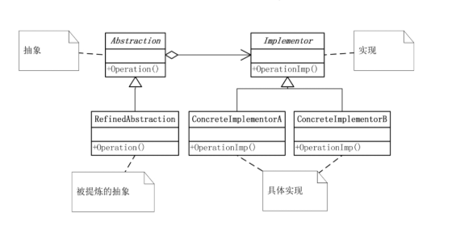

## 概念
桥接模式（Bridge Pattern） 是一种结构型设计模式，它将抽象部分与实现部分分离，使它们可以独立变化。

简单来说：
- 抽象层（Abstraction） 定义高层接口。
- 实现层（Implementor） 提供具体实现。
- 抽象层通过组合实现层对象，而不是继承，从而达到解耦。

常见应用：
- 图形绘制系统（不同形状 + 不同颜色）
- 消息发送系统（不同消息类型 + 不同发送方式）
- JDBC 驱动（Java 抽象接口 + 各种数据库厂商实现）

## 结构

- Abstraction（抽象类）: 定义抽象的接口，包含一个对实现层的引用。
- RefinedAbstraction（扩展抽象类）: 扩展 Abstraction，调用实现层的方法。
- Implementor（实现接口）: 定义实现接口，供 Abstraction 调用。
- ConcreteImplementor（具体实现类）: 提供具体的实现。

## 例子
```java
// 实现层接口
interface MessageSender {
    void send(String message);
}

// 具体实现：邮件发送
class EmailSender implements MessageSender {
    @Override
    public void send(String message) {
        System.out.println("通过【Email】发送消息: " + message);
    }
}

// 具体实现：短信发送
class SMSSender implements MessageSender {
    @Override
    public void send(String message) {
        System.out.println("通过【SMS】发送消息: " + message);
    }
}

// 抽象类
abstract class Message {
    protected MessageSender sender;  // 桥接的关键：组合而不是继承

    public Message(MessageSender sender) {
        this.sender = sender;
    }

    public abstract void sendMessage(String message);
}

// 扩展抽象类：普通消息
class NormalMessage extends Message {
    public NormalMessage(MessageSender sender) {
        super(sender);
    }

    @Override
    public void sendMessage(String message) {
        System.out.print("[普通] ");
        sender.send(message);
    }
}

// 扩展抽象类：加急消息
class UrgentMessage extends Message {
    public UrgentMessage(MessageSender sender) {
        super(sender);
    }

    @Override
    public void sendMessage(String message) {
        System.out.print("[加急] ");
        sender.send(message);
    }
}

// 测试类
public class BridgePatternDemo {
    public static void main(String[] args) {
        MessageSender emailSender = new EmailSender();
        MessageSender smsSender = new SMSSender();

        Message normalEmail = new NormalMessage(emailSender);
        Message urgentSMS = new UrgentMessage(smsSender);

        normalEmail.sendMessage("开会通知");
        urgentSMS.sendMessage("系统宕机，请立即处理！");
    }
}
```

```java
// 实现层接口：颜色
interface Color {
    void applyColor();
}

// 具体实现类：红色
class RedColor implements Color {
    @Override
    public void applyColor() {
        System.out.println("红色");
    }
}

// 具体实现类：蓝色
class BlueColor implements Color {
    @Override
    public void applyColor() {
        System.out.println("蓝色");
    }
}

// 抽象类：形状
abstract class Shape {
    protected Color color;  // 桥接关键：组合而不是继承

    public Shape(Color color) {
        this.color = color;
    }

    public abstract void draw();
}

// 扩展抽象类：圆形
class Circle extends Shape {
    public Circle(Color color) {
        super(color);
    }

    @Override
    public void draw() {
        System.out.print("绘制圆形，颜色：");
        color.applyColor();
    }
}

// 扩展抽象类：矩形
class Rectangle extends Shape {
    public Rectangle(Color color) {
        super(color);
    }

    @Override
    public void draw() {
        System.out.print("绘制矩形，颜色：");
        color.applyColor();
    }
}

// 测试类
public class BridgePatternShapeDemo {
    public static void main(String[] args) {
        Shape redCircle = new Circle(new RedColor());
        Shape blueRectangle = new Rectangle(new BlueColor());

        redCircle.draw();
        blueRectangle.draw();
    }
}
```
## 优点
- 抽象与实现解耦，可以独立扩展。
- 增加新的消息类型或发送方式都很方便。
- 避免类爆炸（否则“消息 × 发送方式”会导致大量子类）。

## 缺点
- 增加了系统设计复杂度。
- 抽象层和实现层的组合关系需要维护。