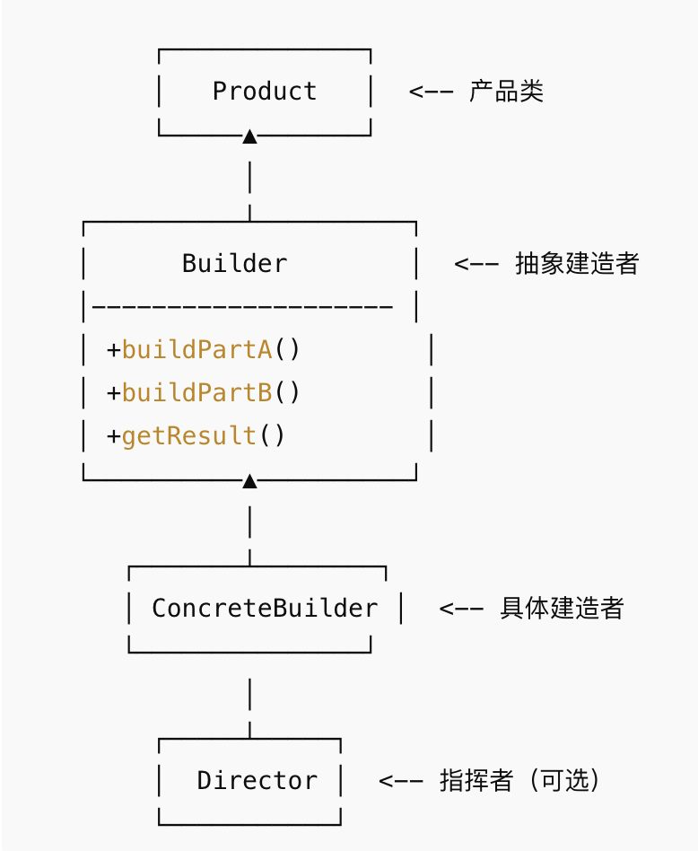

## 概念
将一个复杂对象的构建与它的表示分离，使同样的构建过程可以创建不同的表示。对象构建过程复杂，但客户端只关心最后的产品。通过一步步构建或链式调用来创建对象，避免构造函数参数过多。
## 结构

Product：最终要构建的对象。

Builder：定义构建步骤的接口。

ConcreteBuilder：实现 Builder 接口，生成具体产品。

Director（可选）：按特定顺序调用构建步骤，指导产品创建。
## 例子
```java
// 产品类
class Computer {
    private String CPU;
    private String RAM;
    private String storage;

    public void setCPU(String CPU) { this.CPU = CPU; }
    public void setRAM(String RAM) { this.RAM = RAM; }
    public void setStorage(String storage) { this.storage = storage; }

    @Override
    public String toString() {
        return "Computer [CPU=" + CPU + ", RAM=" + RAM + ", Storage=" + storage + "]";
    }
}

// 抽象建造者
abstract class Builder {
    protected Computer computer = new Computer();
    public abstract void buildCPU();
    public abstract void buildRAM();
    public abstract void buildStorage();
    public Computer getComputer() { return computer; }
}

// 具体建造者
class GamingComputerBuilder extends Builder {
    @Override
    public void buildCPU() { computer.setCPU("Intel i9"); }
    @Override
    public void buildRAM() { computer.setRAM("32GB"); }
    @Override
    public void buildStorage() { computer.setStorage("1TB SSD"); }
}

class OfficeComputerBuilder extends Builder {
    @Override
    public void buildCPU() { computer.setCPU("Intel i5"); }
    @Override
    public void buildRAM() { computer.setRAM("16GB"); }
    @Override
    public void buildStorage() { computer.setStorage("512GB SSD"); }
}

// 指挥者（可选）
class Director {
    private Builder builder;
    public Director(Builder builder) { this.builder = builder; }
    public Computer construct() {
        builder.buildCPU();
        builder.buildRAM();
        builder.buildStorage();
        return builder.getComputer();
    }
}

// 客户端
public class BuilderDemo {
    public static void main(String[] args) {
        // 游戏电脑
        Builder gamingBuilder = new GamingComputerBuilder();
        Director director1 = new Director(gamingBuilder);
        Computer gamingPC = director1.construct();
        System.out.println("游戏电脑: " + gamingPC);

        // 办公电脑
        Builder officeBuilder = new OfficeComputerBuilder();
        Director director2 = new Director(officeBuilder);
        Computer officePC = director2.construct();
        System.out.println("办公电脑: " + officePC);
    }
}
```
## 优点
- 分离了复杂对象的构建和表示，解耦客户端和对象创建过程。
- 可一步步构建，灵活控制构建顺序。
- 支持不同的产品组合（同样构建过程，不同产品）。
## 缺点
- 类比较多，系统复杂度增加。
- 对简单对象使用会显得冗余。
## 使用场景
- 对象构建过程复杂，参数多。
- 对象构建步骤固定，但部件实现可变化。
- 需要不同配置组合的对象。
## 典型场景：
- 复杂文档生成（如 HTML、PDF 报告生成器）
- 电脑、汽车组装流程