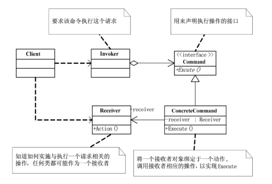

## 概念
命令模式（Command Pattern） 是一种行为型设计模式：将一个请求封装为一个对象，从而让你用不同的请求对客户进行参数化；对请求排队或记录请求日志；支持撤销操作（Undo）。

常见应用：
- GUI 按钮点击（按钮绑定命令，而不是具体逻辑）。
- 文本编辑器里的撤销/重做。
- 任务队列。

## 结构

- Command（抽象命令接口）: 定义执行命令的接口。
- ConcreteCommand（具体命令类）: 绑定接收者，调用接收者的功能。
- Receiver（接收者）: 真正执行操作的对象。
- Invoker（调用者）: 请求的发送者，调用命令对象来执行请求。

## 例子
```java
// 命令接口
interface Command {
    void execute();
    void undo();
}

// 接收者：电灯
class Light {
    public void on() {
        System.out.println("灯已打开");
    }

    public void off() {
        System.out.println("灯已关闭");
    }
}

// 具体命令：开灯
class LightOnCommand implements Command {
    private final Light light;

    public LightOnCommand(Light light) {
        this.light = light;
    }

    @Override
    public void execute() {
        light.on();
    }

    @Override
    public void undo() {
        light.off();
    }
}

// 具体命令：关灯
class LightOffCommand implements Command {
    private final Light light;

    public LightOffCommand(Light light) {
        this.light = light;
    }

    @Override
    public void execute() {
        light.off();
    }

    @Override
    public void undo() {
        light.on();
    }
}

// 调用者：遥控器
class RemoteControl {
    private Command command;

    public void setCommand(Command command) {
        this.command = command;
    }

    public void pressButton() {
        if (command != null) {
            command.execute();
        }
    }

    public void pressUndo() {
        if (command != null) {
            command.undo();
        }
    }
}

// 测试类
public class CommandPatternDemo {
    public static void main(String[] args) {
        Light livingRoomLight = new Light();

        Command lightOn = new LightOnCommand(livingRoomLight);
        Command lightOff = new LightOffCommand(livingRoomLight);

        RemoteControl remote = new RemoteControl();

        // 开灯
        remote.setCommand(lightOn);
        remote.pressButton();

        // 撤销（关灯）
        remote.pressUndo();

        // 关灯
        remote.setCommand(lightOff);
        remote.pressButton();

        // 撤销（开灯）
        remote.pressUndo();
    }
}
```
## 优点
- 解耦调用者和接收者。
- 易于扩展新命令。
- 可以实现命令队列、日志记录、撤销/重做。

## 缺点
- 类的数量可能会增加（每个命令都需要一个类）。