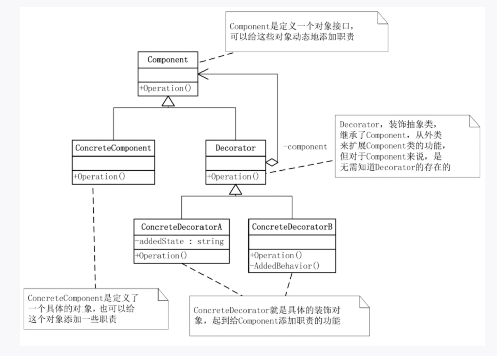

## 概念
在不改变原有类的基础上，动态地给对象添加新的功能。
## 结构

装饰器模式主要包含四个角色：
- 抽象组件（Component）：定义对象的接口。
- 具体组件（ConcreteComponent）：被装饰的原始对象。
- 抽象装饰器（Decorator）：持有一个 Component 对象，并实现 Component 接口。
- 具体装饰器（ConcreteDecorator）：扩展装饰器，增加新功能。

如果只有一个ConcreteComponent类而没有抽象的Component类，那么Decorator类可以是ConcreteComponent的一个子类。同样道理，如果只有一个ConcreteDecorator类，那么就没有必要建立一个单独的Decorator类，而可以把Decorator和ConcreteDecorator的责任合并成一个类。
## 例子
```java
// 抽象组件
interface Coffee {
    String getDescription();
    double getCost();
}

// 具体组件 - 基础咖啡
class SimpleCoffee implements Coffee {
    @Override
    public String getDescription() {
        return "普通咖啡";
    }

    @Override
    public double getCost() {
        return 5.0;
    }
}

// 抽象装饰器
abstract class CoffeeDecorator implements Coffee {
    protected Coffee decoratedCoffee; // 被包装的咖啡

    public CoffeeDecorator(Coffee coffee) {
        this.decoratedCoffee = coffee;
    }

    @Override
    public String getDescription() {
        return decoratedCoffee.getDescription();
    }

    @Override
    public double getCost() {
        return decoratedCoffee.getCost();
    }
}

// 具体装饰器 - 牛奶
class MilkDecorator extends CoffeeDecorator {
    public MilkDecorator(Coffee coffee) {
        super(coffee);
    }

    @Override
    public String getDescription() {
        return super.getDescription() + " + 牛奶";
    }

    @Override
    public double getCost() {
        return super.getCost() + 2.0;
    }
}

// 具体装饰器 - 糖
class SugarDecorator extends CoffeeDecorator {
    public SugarDecorator(Coffee coffee) {
        super(coffee);
    }

    @Override
    public String getDescription() {
        return super.getDescription() + " + 糖";
    }

    @Override
    public double getCost() {
        return super.getCost() + 1.0;
    }
}

// 客户端
public class DecoratorDemo {
    public static void main(String[] args) {
        Coffee coffee = new SimpleCoffee();
        System.out.println(coffee.getDescription() + " 价格: " + coffee.getCost());

        // 加牛奶
        coffee = new MilkDecorator(coffee);
        System.out.println(coffee.getDescription() + " 价格: " + coffee.getCost());

        // 再加糖
        coffee = new SugarDecorator(coffee);
        System.out.println(coffee.getDescription() + " 价格: " + coffee.getCost());
    }
}
```
## 优点
- 可以在运行时动态组合功能（想加什么装饰就加什么）。
- 避免了继承带来的类爆炸问题。
- 符合开闭原则（扩展功能时无需修改已有代码）。
## 缺点
- 会产生很多小类，结构较复杂。
- 多层装饰时调试比较困难。
## 使用场景
- Java IO 库（BufferedInputStream、DataInputStream）就是典型的装饰器模式。
- 需要在运行时动态地组合对象的功能，而不是通过继承固定组合。
