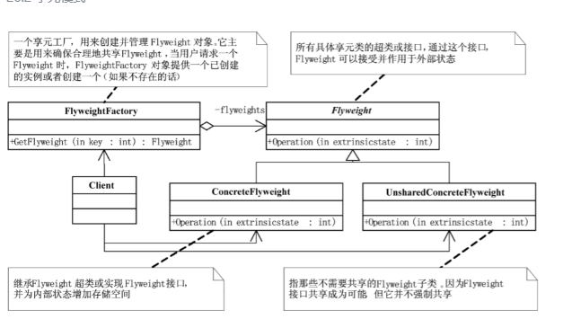

## 概念
享元模式（Flyweight Pattern） 是一种 结构型设计模式：通过共享对象来避免大量拥有相同内容对象的开销；把对象的状态分为 内部状态（可共享，不会随环境改变）和 外部状态（依赖环境，不能共享）；

典型应用场景：
- Java 字符串池（String.intern()）
- 数据库连接池
- 游戏中重复元素（树木、子弹、棋子）

## 结构

- Flyweight（享元接口）: 定义对象的公共方法。
- ConcreteFlyweight（具体享元类）: 实现享元接口，包含可共享的内部状态。
- UnsharedConcreteFlyweight（非共享享元类）（可选）: 外部状态无法共享的对象。
- FlyweightFactory（享元工厂类）: 负责创建和管理享元对象，保证共享性。

外部状态 是一个 概念，它代表不可以共享的那部分数据。

UnsharedConcreteFlyweight 是 实现外部状态的一种类结构，用对象来承载外部状态。

## 例子
内部状态：颜色（共享，不会变）。

外部状态：坐标、半径（每次使用时传入）。
```java
import java.util.HashMap;
import java.util.Map;

// 享元接口
interface Shape {
    void draw(int x, int y, int radius);
}

// 具体享元类：圆
class Circle implements Shape {
    private final String color; // 内部状态（共享）

    public Circle(String color) {
        this.color = color;
    }

    @Override
    public void draw(int x, int y, int radius) {
        System.out.println("绘制一个 " + color + " 的圆，位置(" + x + "," + y + ")，半径 " + radius);
    }
}

// 享元工厂
class ShapeFactory {
    private static final Map<String, Shape> circleMap = new HashMap<>();

    public static Shape getCircle(String color) {
        Circle circle = (Circle) circleMap.get(color);
        if (circle == null) {
            circle = new Circle(color);
            circleMap.put(color, circle);
            System.out.println("创建新的 Circle 对象，颜色：" + color);
        }
        return circle;
    }
}

// 测试类
public class FlyweightPatternDemo {
    private static final String[] colors = {"红色", "绿色", "蓝色", "黑色", "白色"};

    public static void main(String[] args) {
        for (int i = 0; i < 10; i++) {
            Shape circle = ShapeFactory.getCircle(getRandomColor());
            circle.draw(getRandomX(), getRandomY(), getRandomRadius());
        }
    }

    private static String getRandomColor() {
        return colors[(int) (Math.random() * colors.length)];
    }

    private static int getRandomX() {
        return (int) (Math.random() * 100);
    }

    private static int getRandomY() {
        return (int) (Math.random() * 100);
    }

    private static int getRandomRadius() {
        return (int) (Math.random() * 50);
    }
}
```

内部状态（可共享）：棋子的颜色（黑/白）。

外部状态（不可共享）：棋子的坐标位置（每颗棋子的位置都不同）。
```java
import java.util.HashMap;
import java.util.Map;

// 享元接口
interface ChessPiece {
    void draw(Position position);  // 外部状态由参数传入
}

// 具体享元类（共享）：黑棋、白棋
class ConcreteChessPiece implements ChessPiece {
    private final String color;  // 内部状态（共享）

    public ConcreteChessPiece(String color) {
        this.color = color;
    }

    @Override
    public void draw(Position position) {
        System.out.println("绘制 " + color + " 棋子，位置: " + position.getX() + "," + position.getY());
    }
}

// 非共享享元类：棋子的位置
class Position {  // UnsharedConcreteFlyweight
    private final int x;
    private final int y;

    public Position(int x, int y) {
        this.x = x;
        this.y = y;
    }

    public int getX() { return x; }
    public int getY() { return y; }
}

// 享元工厂
class ChessPieceFactory {
    private static final Map<String, ChessPiece> chessMap = new HashMap<>();

    public static ChessPiece getChessPiece(String color) {
        ChessPiece piece = chessMap.get(color);
        if (piece == null) {
            piece = new ConcreteChessPiece(color);
            chessMap.put(color, piece);
            System.out.println("创建新的棋子对象: " + color);
        }
        return piece;
    }
}

// 测试类
public class FlyweightWithUnsharedDemo {
    public static void main(String[] args) {
        // 获取共享对象：黑棋
        ChessPiece black = ChessPieceFactory.getChessPiece("黑棋");
        // 获取共享对象：白棋
        ChessPiece white = ChessPieceFactory.getChessPiece("白棋");

        // 每个棋子的位置是外部状态（不可共享）
        black.draw(new Position(2, 3));
        black.draw(new Position(3, 4));
        white.draw(new Position(4, 5));
        white.draw(new Position(5, 6));
    }
}
```

## 优点
- 大幅减少内存占用，提升性能。
- 内部状态可共享，降低对象数量。

## 缺点
- 需要区分内部状态和外部状态，增加复杂度。
- 系统逻辑可能更复杂（外部状态必须由客户端管理）。