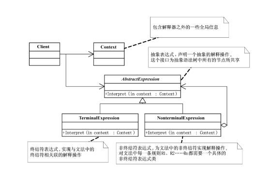

## 概念
解释器模式（Interpreter Pattern） 是一种 行为型设计模式：定义一个语言的文法表示，并提供一个解释器来解释语言中的句子。

适用于某些 规则反复出现 的场景，比如：
- 正则表达式解释器
- SQL 解析器
- 数学表达式计算器

## 结构

- AbstractExpression（抽象表达式）: 声明解释操作的接口。
- TerminalExpression（终结符表达式）: 文法中的基本元素解释器。
- NonTerminalExpression（非终结符表达式）: 文法规则的组合解释器，包含其他表达式。
- Context（上下文环境类）: 存储解释器需要的全局信息。
_ Client（客户端）: 构建语法树，并调用解释操作。

## 例子
```java
import java.util.*;

// 抽象表达式
interface Expression {
    boolean interpret(Map<String, Boolean> context);
}

// 终结符表达式：变量
class VariableExpression implements Expression {
    private String name;

    public VariableExpression(String name) {
        this.name = name;
    }

    @Override
    public boolean interpret(Map<String, Boolean> context) {
        return context.getOrDefault(name, false);
    }
}

// 非终结符表达式：AND
class AndExpression implements Expression {
    private Expression expr1;
    private Expression expr2;

    public AndExpression(Expression expr1, Expression expr2) {
        this.expr1 = expr1;
        this.expr2 = expr2;
    }

    @Override
    public boolean interpret(Map<String, Boolean> context) {
        return expr1.interpret(context) && expr2.interpret(context);
    }
}

// 非终结符表达式：OR
class OrExpression implements Expression {
    private Expression expr1;
    private Expression expr2;

    public OrExpression(Expression expr1, Expression expr2) {
        this.expr1 = expr1;
        this.expr2 = expr2;
    }

    @Override
    public boolean interpret(Map<String, Boolean> context) {
        return expr1.interpret(context) || expr2.interpret(context);
    }
}

// 测试类
public class InterpreterPatternDemo {
    public static void main(String[] args) {
        // 构建表达式：(A AND B) OR C
        Expression A = new VariableExpression("A");
        Expression B = new VariableExpression("B");
        Expression C = new VariableExpression("C");

        Expression expr = new OrExpression(new AndExpression(A, B), C);

        // 上下文赋值
        Map<String, Boolean> context = new HashMap<>();
        context.put("A", true);
        context.put("B", false);
        context.put("C", true);

        boolean result = expr.interpret(context);
        System.out.println("(A AND B) OR C = " + result);
    }
}
```
## 优点
- 易于扩展新规则（增加一个表达式类即可）。
- 灵活，可以动态组合表达式形成语法树。
## 缺点
- 语法规则复杂时，类的数量会急剧增加。
- 性能可能较低，不适合复杂语言解释。