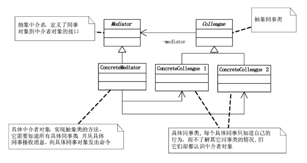

## 概念
中介者模式（Mediator Pattern） 是一种 行为型设计模式，它通过引入一个中介对象来封装对象之间的交互：各个对象（同事对象）不再直接引用彼此，而是通过中介者通信；降低了对象之间的耦合；

常用于聊天系统、组件交互、UI 控件交互等场景。
## 结构

- Mediator（抽象中介者）: 定义同事对象之间的交互接口。
- ConcreteMediator（具体中介者）: 实现协调逻辑，负责管理和调度同事对象。
- Colleague（抽象同事类）: 持有中介者对象的引用。
- ConcreteColleague（具体同事类）: 与其他同事通信时，通过中介者来转发请求。

## 例子
```java
// 抽象中介者
interface ChatMediator {
    void sendMessage(String msg, User user);
    void addUser(User user);
}

// 具体中介者：聊天室
class ChatRoom implements ChatMediator {
    private List<User> users = new ArrayList<>();

    @Override
    public void addUser(User user) {
        users.add(user);
    }

    @Override
    public void sendMessage(String msg, User sender) {
        for (User user : users) {
            // 不发给自己
            if (user != sender) {
                user.receive(msg, sender.getName());
            }
        }
    }
}

// 抽象同事类
abstract class User {
    protected ChatMediator mediator;
    protected String name;

    public User(ChatMediator mediator, String name) {
        this.mediator = mediator;
        this.name = name;
    }

    public String getName() {
        return name;
    }

    abstract void send(String msg);
    abstract void receive(String msg, String senderName);
}

// 具体同事类
class ChatUser extends User {
    public ChatUser(ChatMediator mediator, String name) {
        super(mediator, name);
    }

    @Override
    void send(String msg) {
        System.out.println(this.name + " 发送: " + msg);
        mediator.sendMessage(msg, this);
    }

    @Override
    void receive(String msg, String senderName) {
        System.out.println(this.name + " 收到来自 " + senderName + " 的消息: " + msg);
    }
}

// 测试类
public class MediatorPatternDemo {
    public static void main(String[] args) {
        ChatMediator chatRoom = new ChatRoom();

        User user1 = new ChatUser(chatRoom, "Alice");
        User user2 = new ChatUser(chatRoom, "Bob");
        User user3 = new ChatUser(chatRoom, "Charlie");

        chatRoom.addUser(user1);
        chatRoom.addUser(user2);
        chatRoom.addUser(user3);

        user1.send("大家好！");
        user2.send("嗨，Alice！");
    }
}
```
## 优点
- 解除同事对象之间的耦合。
- 将对象交互集中在中介者，便于维护。
- 可以更容易地扩展和修改交互逻辑。

## 缺点
- 中介者可能变得非常复杂，成为“上帝对象”。