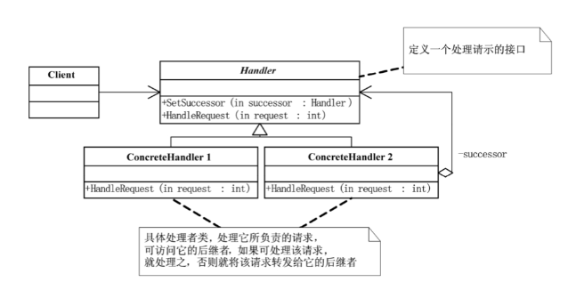

## 概念
责任链模式（Chain of Responsibility Pattern） 是一种行为型设计模式：将请求沿着一条链传递，直到有对象处理它为止；请求的发送者与接收者解耦；常用于请求的过滤、拦截、审批等场景。

典型应用：
- Java Web Servlet Filter 链
- 日志处理（不同级别日志不同处理器）
- OA 审批流程（员工 → 经理 → 总监 → 董事长）

## 结构

- Handler（抽象处理者）: 定义处理请求的接口, 持有下一个处理者的引用
- ConcreteHandler（具体处理者）: 处理自己能处理的请求，否则交给下一个处理者
- Client（客户端）: 创建责任链并提交请求

## 例子
```java
// 抽象处理者
abstract class LeaveHandler {
    protected LeaveHandler nextHandler;

    public void setNextHandler(LeaveHandler nextHandler) {
        this.nextHandler = nextHandler;
    }

    public abstract void handleRequest(int days);
}

// 具体处理者：主管
class Supervisor extends LeaveHandler {
    @Override
    public void handleRequest(int days) {
        if (days <= 2) {
            System.out.println("主管批准了 " + days + " 天的请假。");
        } else if (nextHandler != null) {
            nextHandler.handleRequest(days);
        }
    }
}

// 具体处理者：经理
class Manager extends LeaveHandler {
    @Override
    public void handleRequest(int days) {
        if (days <= 5) {
            System.out.println("经理批准了 " + days + " 天的请假。");
        } else if (nextHandler != null) {
            nextHandler.handleRequest(days);
        }
    }
}

// 具体处理者：总经理
class GeneralManager extends LeaveHandler {
    @Override
    public void handleRequest(int days) {
        if (days > 5) {
            System.out.println("总经理批准了 " + days + " 天的请假。");
        }
    }
}

// 测试类
public class ChainOfResponsibilityDemo {
    public static void main(String[] args) {
        // 创建处理链
        LeaveHandler supervisor = new Supervisor();
        LeaveHandler manager = new Manager();
        LeaveHandler generalManager = new GeneralManager();

        supervisor.setNextHandler(manager);
        manager.setNextHandler(generalManager);

        // 提交请求
        supervisor.handleRequest(1);
        supervisor.handleRequest(3);
        supervisor.handleRequest(7);
    }
}
```
## 优点
- 请求与处理解耦，灵活可扩展。
- 可以动态组合责任链。
- 符合 开闭原则（新增处理者不影响原有代码）。

## 缺点
- 可能导致责任链过长，影响性能。
- 不保证一定会有处理者接收请求。