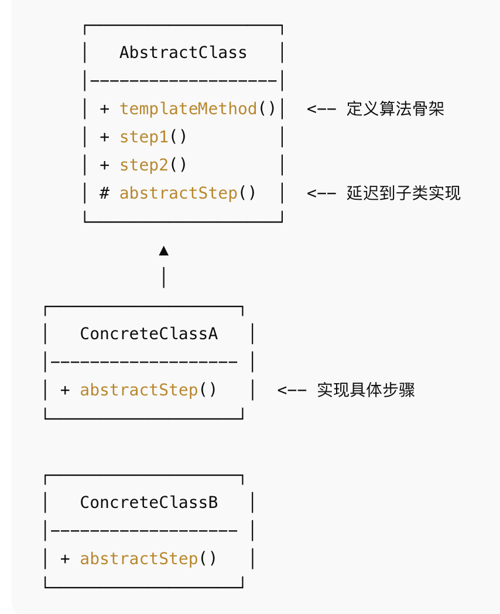

## 概念
在一个抽象类中定义一个操作的 骨架（固定流程），而将一些可变步骤延迟到子类中去实现。这样子类可以在不改变算法结构的情况下，重新定义某些步骤的实现。
## 结构

## 例子
```java
// 抽象类：定义模板方法
abstract class Beverage {
    // 模板方法，定义了制作饮料的流程
    public final void makeBeverage() {
        boilWater();
        brew();
        pourInCup();
        addCondiments();
    }

    // 通用方法（所有子类都一样）
    private void boilWater() {
        System.out.println("把水煮沸");
    }

    private void pourInCup() {
        System.out.println("倒入杯子");
    }

    // 抽象方法（子类必须实现）
    protected abstract void brew();
    protected abstract void addCondiments();
}

// 具体子类：咖啡
class Coffee extends Beverage {
    @Override
    protected void brew() {
        System.out.println("冲泡咖啡粉");
    }

    @Override
    protected void addCondiments() {
        System.out.println("加糖和牛奶");
    }
}

// 具体子类：茶
class Tea extends Beverage {
    @Override
    protected void brew() {
        System.out.println("浸泡茶叶");
    }

    @Override
    protected void addCondiments() {
        System.out.println("加柠檬");
    }
}

// 测试
public class TemplateMethodDemo {
    public static void main(String[] args) {
        System.out.println("制作咖啡：");
        Beverage coffee = new Coffee();
        coffee.makeBeverage();

        System.out.println("\n制作茶：");
        Beverage tea = new Tea();
        tea.makeBeverage();
    }
}
```
带钩子方法的模版方法模式

钩子方法的特点是：在父类提供一个默认实现，子类可以选择性覆盖，从而控制流程中的某些步骤是否执行。
```java
// 抽象类：模板方法
abstract class BeverageWithHook {
    // 模板方法
    public final void makeBeverage() {
        boilWater();
        brew();
        pourInCup();
        // 钩子方法决定是否加调料
        if (customerWantsCondiments()) {
            addCondiments();
        }
    }

    // 固定流程步骤
    private void boilWater() {
        System.out.println("把水煮沸");
    }

    private void pourInCup() {
        System.out.println("倒入杯子");
    }

    // 抽象方法由子类实现
    protected abstract void brew();
    protected abstract void addCondiments();

    // 钩子方法（默认返回 true，可以选择覆盖）
    protected boolean customerWantsCondiments() {
        return true;
    }
}

// 具体子类：咖啡
class CoffeeWithHook extends BeverageWithHook {
    @Override
    protected void brew() {
        System.out.println("冲泡咖啡粉");
    }

    @Override
    protected void addCondiments() {
        System.out.println("加糖和牛奶");
    }

    // 钩子方法：根据顾客喜好选择是否加调料
    @Override
    protected boolean customerWantsCondiments() {
        // 假设顾客不想加调料
        return false;
    }
}

// 具体子类：茶
class TeaWithHook extends BeverageWithHook {
    @Override
    protected void brew() {
        System.out.println("浸泡茶叶");
    }

    @Override
    protected void addCondiments() {
        System.out.println("加柠檬");
    }
}

// 客户端测试
public class TemplateHookDemo {
    public static void main(String[] args) {
        System.out.println("制作咖啡（顾客不想加调料）：");
        BeverageWithHook coffee = new CoffeeWithHook();
        coffee.makeBeverage();

        System.out.println("\n制作茶（默认加调料）：");
        BeverageWithHook tea = new TeaWithHook();
        tea.makeBeverage();
    }
}
```
## 优点
- 复用代码，避免重复。
- 稳定整体流程，让子类只关心差异部分。
## 缺点：
- 继承结构会导致子类过多。
- 子类必须遵循父类设计，不够灵活。