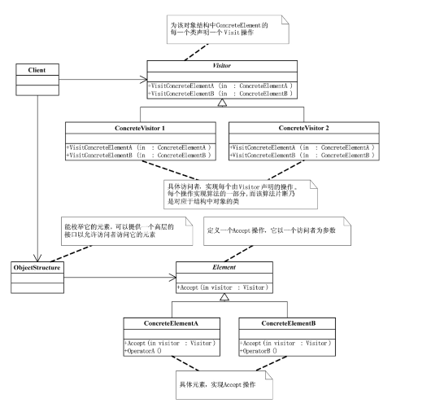

## 概念
访问者模式（Visitor Pattern） 是一种 行为型设计模式：允许在不修改对象结构的前提下，定义作用于这些对象的新操作。适用于 数据结构稳定、但 操作经常变化 的场景。

常见应用：
- 编译器语法树处理（遍历 AST 做不同分析）
- 报表生成（不同统计方式）
- XML/JSON 文档处理

## 结构

- Visitor（抽象访问者）: 定义对元素的访问操作接口。
- ConcreteVisitor（具体访问者）: 实现不同的访问逻辑。
- Element（抽象元素）: 接受访问者的 accept 方法。
- ConcreteElement（具体元素）: 实现 accept 方法，并调用访问者的方法。
- ObjectStructure（对象结构）: 提供元素集合，允许访问者遍历。

## 例子
```java
import java.util.*;

// 抽象访问者
interface Visitor {
    void visit(Programmer programmer);
    void visit(Designer designer);
}

// 具体访问者：HR 统计薪资
class HRVisitor implements Visitor {
    @Override
    public void visit(Programmer programmer) {
        System.out.println("HR 统计程序员薪资，姓名：" + programmer.getName() + "，工资：" + programmer.getSalary());
    }

    @Override
    public void visit(Designer designer) {
        System.out.println("HR 统计设计师薪资，姓名：" + designer.getName() + "，工资：" + designer.getSalary());
    }
}

// 具体访问者：CEO 绩效评估
class CEOVisitor implements Visitor {
    @Override
    public void visit(Programmer programmer) {
        System.out.println("CEO 评估程序员绩效，姓名：" + programmer.getName() + "，代码行数：" + programmer.getCodeLines());
    }

    @Override
    public void visit(Designer designer) {
        System.out.println("CEO 评估设计师绩效，姓名：" + designer.getName() + "，作品数：" + designer.getDesigns());
    }
}

// 抽象元素
interface Employee {
    void accept(Visitor visitor);
}

// 具体元素：程序员
class Programmer implements Employee {
    private String name;
    private int salary;
    private int codeLines;

    public Programmer(String name, int salary, int codeLines) {
        this.name = name;
        this.salary = salary;
        this.codeLines = codeLines;
    }

    public String getName() { return name; }
    public int getSalary() { return salary; }
    public int getCodeLines() { return codeLines; }

    @Override
    public void accept(Visitor visitor) {
        visitor.visit(this);
    }
}

// 具体元素：设计师
class Designer implements Employee {
    private String name;
    private int salary;
    private int designs;

    public Designer(String name, int salary, int designs) {
        this.name = name;
        this.salary = salary;
        this.designs = designs;
    }

    public String getName() { return name; }
    public int getSalary() { return salary; }
    public int getDesigns() { return designs; }

    @Override
    public void accept(Visitor visitor) {
        visitor.visit(this);
    }
}

// 对象结构：员工集合
class Company {
    private List<Employee> employees = new ArrayList<>();

    public void addEmployee(Employee e) {
        employees.add(e);
    }

    public void accept(Visitor visitor) {
        for (Employee e : employees) {
            e.accept(visitor);
        }
    }
}

// 测试类
public class VisitorPatternDemo {
    public static void main(String[] args) {
        Company company = new Company();

        company.addEmployee(new Programmer("Alice", 10000, 5000));
        company.addEmployee(new Designer("Bob", 8000, 20));

        Visitor hr = new HRVisitor();
        Visitor ceo = new CEOVisitor();

        System.out.println("=== HR 统计薪资 ===");
        company.accept(hr);

        System.out.println("\n=== CEO 绩效评估 ===");
        company.accept(ceo);
    }
}
```
## 优点
- 新增操作非常方便（只需增加新的 Visitor）。
- 解耦数据结构和操作，职责分明。
## 缺点
- 新增元素类型困难（需要修改所有 Visitor）。
- 可能导致访问者类过多。