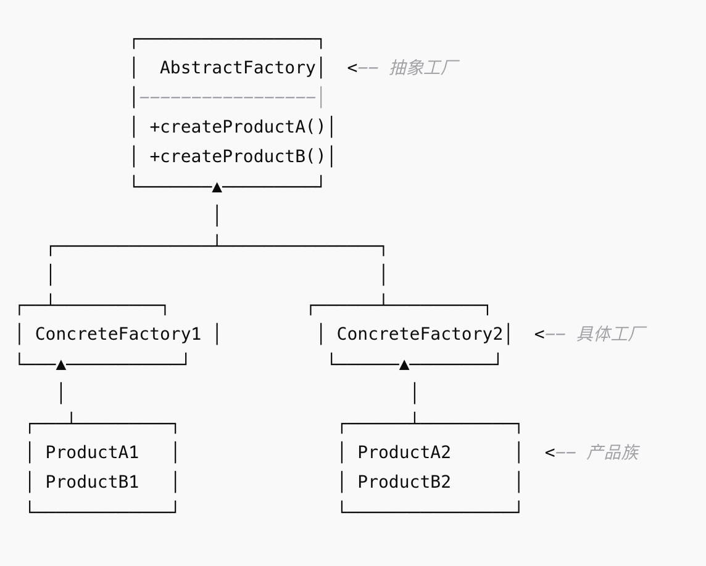

## 概念
抽象工厂模式（Abstract Factory Pattern）：提供一个创建一组相关或相互依赖对象的接口，而无需指定它们的具体实现类。

和工厂方法模式的区别：
- 工厂方法：一个工厂只生产一种产品。
- 抽象工厂：一个工厂生产多个相关产品（产品族）。
## 结构

## 例子
```java
// 抽象产品 A：按钮
interface Button {
    void paint();
}

// 抽象产品 B：复选框
interface Checkbox {
    void paint();
}

// 具体产品：Windows 按钮
class WindowsButton implements Button {
    @Override
    public void paint() {
        System.out.println("Windows 风格的按钮");
    }
}

// 具体产品：Windows 复选框
class WindowsCheckbox implements Checkbox {
    @Override
    public void paint() {
        System.out.println("Windows 风格的复选框");
    }
}

// 具体产品：Mac 按钮
class MacButton implements Button {
    @Override
    public void paint() {
        System.out.println("Mac 风格的按钮");
    }
}

// 具体产品：Mac 复选框
class MacCheckbox implements Checkbox {
    @Override
    public void paint() {
        System.out.println("Mac 风格的复选框");
    }
}

// 抽象工厂
interface GUIFactory {
    Button createButton();
    Checkbox createCheckbox();
}

// 具体工厂：Windows 工厂
class WindowsFactory implements GUIFactory {
    @Override
    public Button createButton() {
        return new WindowsButton();
    }

    @Override
    public Checkbox createCheckbox() {
        return new WindowsCheckbox();
    }
}

// 具体工厂：Mac 工厂
class MacFactory implements GUIFactory {
    @Override
    public Button createButton() {
        return new MacButton();
    }

    @Override
    public Checkbox createCheckbox() {
        return new MacCheckbox();
    }
}

// 客户端
public class AbstractFactoryDemo {
    public static void main(String[] args) {
        // 假设当前系统是 Mac
        GUIFactory factory = new MacFactory();
        Button button = factory.createButton();
        Checkbox checkbox = factory.createCheckbox();

        button.paint();
        checkbox.paint();

        System.out.println("---- 切换到 Windows 风格 ----");

        // 切换到 Windows
        factory = new WindowsFactory();
        button = factory.createButton();
        checkbox = factory.createCheckbox();

        button.paint();
        checkbox.paint();
    }
}
```
## 优点
- 保证同一产品族的一致性（不会出现 Windows 按钮配 Mac 复选框）。
- 符合开闭原则，新增产品族时只需增加工厂类。
## 缺点
- 难以支持新种类的产品，因为要修改抽象工厂接口（违反开闭原则）。

## 改进
简单工厂模式可以简化客户端代码，客户端不会出现具体工厂的字样，达到了解耦的目的。
```java
// ===== 抽象工厂部分 =====

// 抽象产品 A：按钮
interface Button {
    void paint();
}

// 抽象产品 B：复选框
interface Checkbox {
    void paint();
}

// 抽象工厂
interface GUIFactory {
    Button createButton();
    Checkbox createCheckbox();
}

// Windows 产品族
class WindowsButton implements Button {
    public void paint() { System.out.println("Windows 按钮"); }
}
class WindowsCheckbox implements Checkbox {
    public void paint() { System.out.println("Windows 复选框"); }
}
class WindowsFactory implements GUIFactory {
    public Button createButton() { return new WindowsButton(); }
    public Checkbox createCheckbox() { return new WindowsCheckbox(); }
}

// Mac 产品族
class MacButton implements Button {
    public void paint() { System.out.println("Mac 按钮"); }
}
class MacCheckbox implements Checkbox {
    public void paint() { System.out.println("Mac 复选框"); }
}
class MacFactory implements GUIFactory {
    public Button createButton() { return new MacButton(); }
    public Checkbox createCheckbox() { return new MacCheckbox(); }
}

// ===== 简单工厂部分（工厂选择器）=====
class FactoryProducer {
    public static GUIFactory getFactory(String osType) {
        if ("Windows".equalsIgnoreCase(osType)) {
            return new WindowsFactory();
        } else if ("Mac".equalsIgnoreCase(osType)) {
            return new MacFactory();
        }
        throw new IllegalArgumentException("未知的操作系统类型");
    }
}

// ===== 客户端 =====
public class CombinedFactoryDemo {
    public static void main(String[] args) {
        // 通过简单工厂选择具体工厂
        GUIFactory factory = FactoryProducer.getFactory("Mac");

        Button button = factory.createButton();
        Checkbox checkbox = factory.createCheckbox();

        button.paint();
        checkbox.paint();
    }
}
```
## 再次改进
所有在用简单工厂的地方，都可以考虑用反射技术来去除switch或if，解除分支判断带来的耦合。
```java
// 抽象产品
interface Button {
    void paint();
}
interface Checkbox {
    void paint();
}

// Windows 产品
class WindowsButton implements Button {
    public void paint() { System.out.println("Windows 按钮"); }
}
class WindowsCheckbox implements Checkbox {
    public void paint() { System.out.println("Windows 复选框"); }
}

// Mac 产品
class MacButton implements Button {
    public void paint() { System.out.println("Mac 按钮"); }
}
class MacCheckbox implements Checkbox {
    public void paint() { System.out.println("Mac 复选框"); }
}

// 抽象工厂
interface GUIFactory {
    Button createButton();
    Checkbox createCheckbox();
}

// Windows 工厂
class WindowsFactory implements GUIFactory {
    public Button createButton() { return new WindowsButton(); }
    public Checkbox createCheckbox() { return new WindowsCheckbox(); }
}

// Mac 工厂
class MacFactory implements GUIFactory {
    public Button createButton() { return new MacButton(); }
    public Checkbox createCheckbox() { return new MacCheckbox(); }
}

// 工厂提供者（反射版，不写 if/switch）
class FactoryProducer {
    public static GUIFactory getFactory(String factoryClassName) {
        try {
            Class<?> clazz = Class.forName(factoryClassName);
            return (GUIFactory) clazz.getDeclaredConstructor().newInstance();
        } catch (Exception e) {
            throw new RuntimeException("无法创建工厂: " + factoryClassName, e);
        }
    }
}

// 测试
public class ReflectionFactoryDemo {
    public static void main(String[] args) {
        // 直接传工厂类名
        GUIFactory factory = FactoryProducer.getFactory("MacFactory");

        Button button = factory.createButton();
        Checkbox checkbox = factory.createCheckbox();

        button.paint();
        checkbox.paint();
    }
}
```
## 使用配置文件改进
通过读取配置文件，避免将工厂类名写死在客户端代码中。
```properties
factoryClass=MacFactory
```
```java
import java.io.FileInputStream;
import java.io.IOException;
import java.util.Properties;
// 抽象产品
interface Button {
    void paint();
}
interface Checkbox {
    void paint();
}

// Windows 产品
class WindowsButton implements Button {
    public void paint() { System.out.println("Windows 按钮"); }
}
class WindowsCheckbox implements Checkbox {
    public void paint() { System.out.println("Windows 复选框"); }
}

// Mac 产品
class MacButton implements Button {
    public void paint() { System.out.println("Mac 按钮"); }
}
class MacCheckbox implements Checkbox {
    public void paint() { System.out.println("Mac 复选框"); }
}

// 抽象工厂
interface GUIFactory {
    Button createButton();
    Checkbox createCheckbox();
}

// Windows 工厂
class WindowsFactory implements GUIFactory {
    public Button createButton() { return new WindowsButton(); }
    public Checkbox createCheckbox() { return new WindowsCheckbox(); }
}

// Mac 工厂
class MacFactory implements GUIFactory {
    public Button createButton() { return new MacButton(); }
    public Checkbox createCheckbox() { return new MacCheckbox(); }
}

// 工厂提供者（反射版，不写 if/switch）
class FactoryProducer {
    public static GUIFactory getFactory(String factoryClassName) {
        try {
            Class<?> clazz = Class.forName(factoryClassName);
            return (GUIFactory) clazz.getDeclaredConstructor().newInstance();
        } catch (Exception e) {
            throw new RuntimeException("无法创建工厂: " + factoryClassName, e);
        }
    }
}

public class ConfigFactoryDemo {
    public static void main(String[] args) throws IOException {
        // 读取配置文件
        Properties props = new Properties();
        props.load(new FileInputStream("config.properties"));

        String factoryClassName = props.getProperty("factoryClass");

        // 用反射创建工厂
        GUIFactory factory = FactoryProducer.getFactory(factoryClassName);

        Button button = factory.createButton();
        Checkbox checkbox = factory.createCheckbox();

        button.paint();
        checkbox.paint();
    }
}
```
## 注意
- 抽象工厂模式是最适合用来强调一系列相关产品接口的设计模式。它提供一个创建一系列相关或相互依赖对象的接口，而无需指定它们具体的类。
- 这个模式的核心优势在于:
    - 能够确保一系列相关产品的兼容性
    - 支持产品族的变化，同时保持产品之间的一致性
    - 将产品的创建与使用完全分离
- 抽象工厂模式特别适合处理一系列相关产品接口的场景，比如不同风格的GUI组件(按钮、文本框、菜单等)，确保它们在外观和行为上保持一致性。
