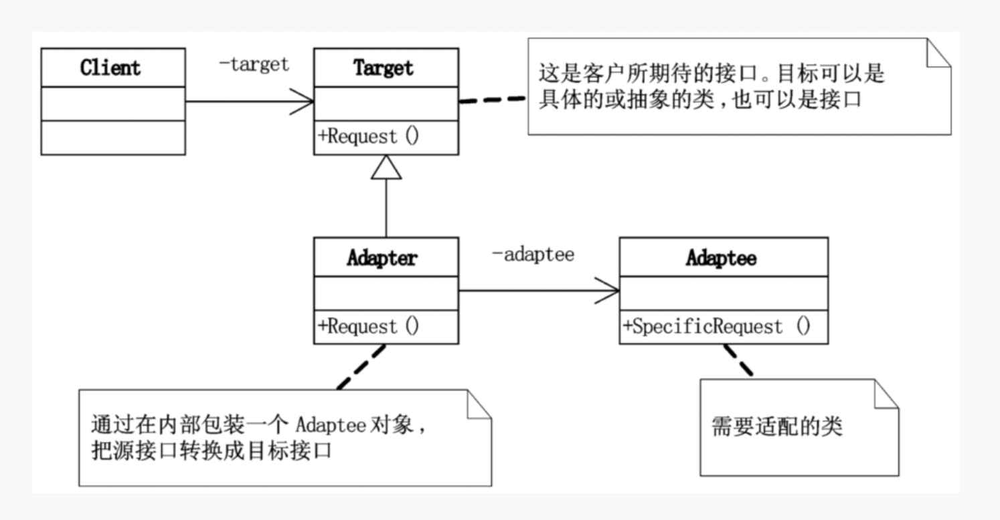

## 
适配器模式是一种结构型模式，用来 将一个类的接口转换为客户希望的另一个接口，使得原本由于接口不兼容而不能一起工作的类可以一起工作。
- 有一个旧的接口（老代码 / 第三方库）。
- 客户端需要一个新接口。
- 写一个适配器类，在中间做“翻译”。
## 

##
```java
// 客户端需要的接口
// 目标接口
interface TypeCCharger {
    void chargeWithTypeC();
}

// 被适配的类
// 老的圆孔充电器
class RoundCharger {
    public void chargeWithRoundPort() {
        System.out.println("使用圆孔充电器充电...");
    }
}

//适配器类
// 适配器：让圆孔充电器也能当 Type-C 使用
class TypeCAdapter implements TypeCCharger {
    private RoundCharger roundCharger;

    public TypeCAdapter(RoundCharger roundCharger) {
        this.roundCharger = roundCharger;
    }

    @Override
    public void chargeWithTypeC() {
        System.out.println("适配器转换接口...");
        roundCharger.chargeWithRoundPort();
    }
}

// 客户端
class Laptop {
    private TypeCCharger charger;

    public Laptop(TypeCCharger charger) {
        this.charger = charger;
    }

    public void charge() {
        System.out.println("笔记本开始充电：");
        charger.chargeWithTypeC();
    }
}

public class AdapterPatternDemo {
    public static void main(String[] args) {
        // 老的圆孔充电器
        RoundCharger roundCharger = new RoundCharger();

        // 用适配器转换成 Type-C
        TypeCCharger adapter = new TypeCAdapter(roundCharger);

        // 笔记本使用 Type-C 接口充电
        Laptop laptop = new Laptop(adapter);
        laptop.charge();
    }
}


