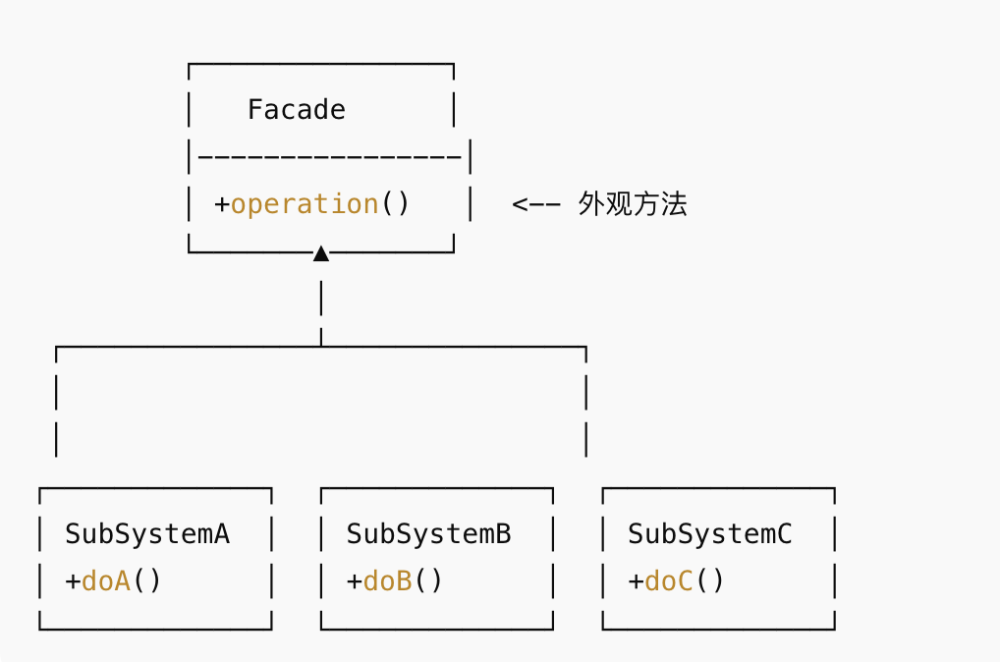

## 概念
- 为子系统中的一组接口提供一个 统一的高层接口，让子系统更易使用。
- 客户端只与外观类交互，不直接操作子系统内部复杂的类。
- 降低系统的复杂性，提高可维护性。
## 结构

Facade：外观类，封装子系统复杂操作，提供简单方法给客户端。
SubSystemX：子系统类，实际功能实现。
客户端：只调用外观类，不直接操作子系统。
## 例子
```java
// 子系统类 - 电视
class TV {
    public void on() {
        System.out.println("电视打开");
    }

    public void off() {
        System.out.println("电视关闭");
    }
}

// 子系统类 - 音响
class SoundSystem {
    public void on() {
        System.out.println("音响打开");
    }

    public void off() {
        System.out.println("音响关闭");
    }
}

// 子系统类 - 灯光
class Lights {
    public void on() {
        System.out.println("灯光打开");
    }

    public void off() {
        System.out.println("灯光关闭");
    }
}

// 外观类 - 家庭影院
class HomeTheaterFacade {
    private TV tv;
    private SoundSystem sound;
    private Lights lights;

    public HomeTheaterFacade(TV tv, SoundSystem sound, Lights lights) {
        this.tv = tv;
        this.sound = sound;
        this.lights = lights;
    }

    // 一键开机
    public void watchMovie() {
        System.out.println("准备看电影...");
        lights.off();
        tv.on();
        sound.on();
    }

    // 一键关闭
    public void endMovie() {
        System.out.println("电影结束...");
        tv.off();
        sound.off();
        lights.on();
    }
}

// 客户端
public class FacadeDemo {
    public static void main(String[] args) {
        TV tv = new TV();
        SoundSystem sound = new SoundSystem();
        Lights lights = new Lights();

        HomeTheaterFacade home = new HomeTheaterFacade(tv, sound, lights);

        // 客户端只调用外观方法
        home.watchMovie();
        System.out.println();
        home.endMovie();
    }
}
```
## 优点
- 降低系统复杂性，客户端与子系统解耦。
- 提高安全性，可以只暴露必要方法。
- 便于维护和扩展。
## 缺点
- 增加外观类维护成本，如果系统功能变化，外观类也要改。
- 不适合对子系统完全隐藏功能的场景，否则可能限制灵活性。
## 使用场景
- 当系统复杂，客户端需要与多个子系统交互。
- 提供统一接口，简化调用流程。
- 需要对外屏蔽子系统内部实现，保证解耦性。
## 注意
- 单一职责原则要求一个类仅负责一项职责（或仅有一个变化原因）。外观类的职责是封装子系统接口、简化客户端调用，但其实现可能需要协调多个子系统的交互。若子系统接口变化，外观类可能需要同步调整，导致其变化原因可能涉及多个子系统，因此不一定严格符合单一职责原则。
- 外观模式的核心作用是作为子系统的“统一入口”。子系统的外部（客户端）与内部（子系统模块）的通信必须通过外观对象完成，外部无需直接与子系统内部模块交互。
- 客户端只需与外观对象交互即可完成功能调用，无需了解子系统的内部细节（如子系统包含哪些模块、如何协作等）。这是外观模式的主要设计目标。
- 迪米特法则（最少知识原则）要求对象间交互尽可能简单，减少不必要的依赖。外观模式通过外观类隔离客户端与子系统，客户端仅需知道外观类，无需了解子系统内部，是迪米特法则的典型实现。
