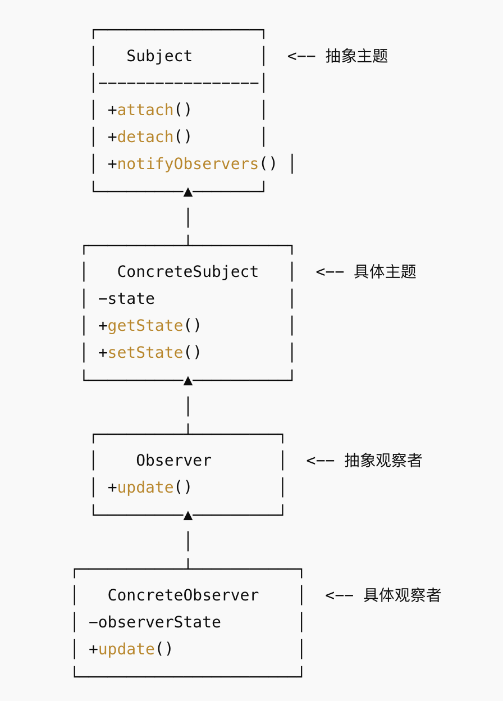

## 概念
定义对象之间 一对多的依赖关系，当一个对象（主题/被观察者）的状态发生变化时，所有依赖它的对象（观察者）都会收到通知并自动更新。
## 结构

## 例子
```java
import java.util.ArrayList;
import java.util.List;

// 抽象观察者
interface Observer {
    void update(float temperature, float humidity);
}

// 抽象主题
interface Subject {
    void attach(Observer o);
    void detach(Observer o);
    void notifyObservers();
}

// 具体主题：气象站
class WeatherData implements Subject {
    private List<Observer> observers = new ArrayList<>();
    private float temperature;
    private float humidity;

    @Override
    public void attach(Observer o) {
        observers.add(o);
    }

    @Override
    public void detach(Observer o) {
        observers.remove(o);
    }

    @Override
    public void notifyObservers() {
        for (Observer o : observers) {
            o.update(temperature, humidity);
        }
    }

    // 设置新数据时，自动通知观察者
    public void setMeasurements(float temperature, float humidity) {
        this.temperature = temperature;
        this.humidity = humidity;
        notifyObservers();
    }
}

// 具体观察者：手机显示屏
class PhoneDisplay implements Observer {
    @Override
    public void update(float temperature, float humidity) {
        System.out.println("手机显示屏 -> 温度: " + temperature + "°C, 湿度: " + humidity + "%");
    }
}

// 具体观察者：电视显示屏
class TVDisplay implements Observer {
    @Override
    public void update(float temperature, float humidity) {
        System.out.println("电视显示屏 -> 温度: " + temperature + "°C, 湿度: " + humidity + "%");
    }
}

// 测试
public class ObserverDemo {
    public static void main(String[] args) {
        WeatherData weatherData = new WeatherData();

        Observer phone = new PhoneDisplay();
        Observer tv = new TVDisplay();

        // 注册观察者
        weatherData.attach(phone);
        weatherData.attach(tv);

        // 更新天气数据
        weatherData.setMeasurements(28.5f, 65.0f);
        System.out.println("---- 天气更新 ----");
        weatherData.setMeasurements(30.0f, 70.0f);
    }
}
```
## 优点
- 主题和观察者之间 松耦合（只依赖接口）。
- 可以自由增加或删除观察者，扩展性好。
- 实现了“事件驱动”模型。
## 缺点
- 通知是广播式的，观察者越多，开销越大。
- 通知链可能导致性能问题或循环依赖。
## 使用场景
- GUI 事件监听（按钮点击 → 通知监听器）。
- 消息队列 / 发布订阅。
- Model-View 分离（MVC 模式里的 Observer）。
- 日志监听、缓存刷新、异步消息通知。
## 注意
- 在观察者模式中,观察者不应该直接修改被观察者(Subject)的状态,这违背了松耦合的设计原则。观察者的职责是接收状态变化的通知并作出响应,而不是直接操作被观察者。
- 观察者模式中,一个被观察者可以有多个观察者订阅它的状态变化,这是多对一的关系。
- 当被观察者状态发生变化时,会通知所有观察者,但具体通知的顺序是不确定的,这取决于具体实现。
- 观察者模式支持动态地添加和移除观察者,这种灵活性是该模式的重要特点。观察者可以随时订阅或取消订阅被观察者的状态变化。
