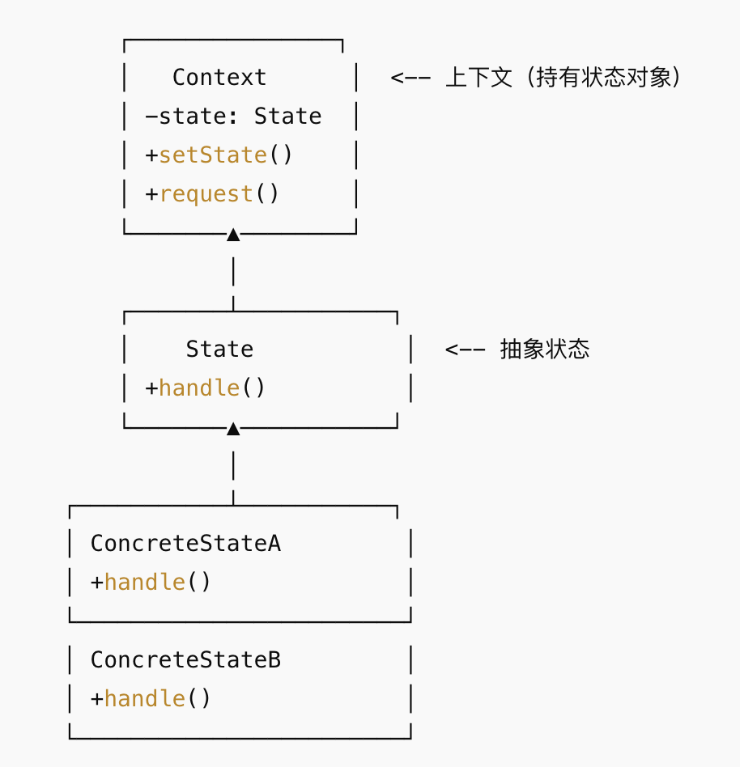

## 概念
状态模式（State Pattern）：允许对象在内部状态改变时改变它的行为，看起来好像修改了它的类。
- 把对象的状态抽象成独立的类，每种状态对应一种行为。
- 状态的切换通过上下文（Context）来管理，而不是写一堆 if/else 或 switch。
## 结构

## 例子
```java
// 抽象状态
interface State {
    void handle(Context context);
}

// 具体状态：开
class OnState implements State {
    @Override
    public void handle(Context context) {
        System.out.println("电灯已开 -> 关闭电灯");
        context.setState(new OffState()); // 切换到关状态
    }
}

// 具体状态：关
class OffState implements State {
    @Override
    public void handle(Context context) {
        System.out.println("电灯已关 -> 打开电灯");
        context.setState(new OnState()); // 切换到开状态
    }
}

// 上下文
class Context {
    private State state;

    public Context(State state) {
        this.state = state;
    }

    public void setState(State state) {
        this.state = state;
    }

    public void request() {
        state.handle(this);
    }
}

// 测试
public class StatePatternDemo {
    public static void main(String[] args) {
        Context light = new Context(new OffState()); // 初始状态：关

        light.request(); // 关 -> 开
        light.request(); // 开 -> 关
        light.request(); // 关 -> 开
    }
}
```

```java
// 抽象状态
interface OrderState {
    void next(OrderContext context);
    void prev(OrderContext context);
    void printStatus();
}

// 待支付
class PendingPaymentState implements OrderState {
    public void next(OrderContext context) {
        System.out.println("订单已支付，进入已支付状态。");
        context.setState(new PaidState());
    }

    public void prev(OrderContext context) {
        System.out.println("订单还在待支付状态，不能回退。");
    }

    public void printStatus() {
        System.out.println("订单状态：待支付");
    }
}

// 已支付
class PaidState implements OrderState {
    public void next(OrderContext context) {
        System.out.println("订单已发货，进入已发货状态。");
        context.setState(new ShippedState());
    }

    public void prev(OrderContext context) {
        System.out.println("退回到待支付状态。");
        context.setState(new PendingPaymentState());
    }

    public void printStatus() {
        System.out.println("订单状态：已支付");
    }
}

// 已发货
class ShippedState implements OrderState {
    public void next(OrderContext context) {
        System.out.println("订单已完成，进入已完成状态。");
        context.setState(new CompletedState());
    }

    public void prev(OrderContext context) {
        System.out.println("退回到已支付状态。");
        context.setState(new PaidState());
    }

    public void printStatus() {
        System.out.println("订单状态：已发货");
    }
}

// 已完成
class CompletedState implements OrderState {
    public void next(OrderContext context) {
        System.out.println("订单已经是完成状态，不能再前进。");
    }

    public void prev(OrderContext context) {
        System.out.println("退回到已发货状态。");
        context.setState(new ShippedState());
    }

    public void printStatus() {
        System.out.println("订单状态：已完成");
    }
}

// 上下文
class OrderContext {
    private OrderState state;

    public OrderContext() {
        // 初始状态：待支付
        state = new PendingPaymentState();
    }

    public void setState(OrderState state) {
        this.state = state;
    }

    public void nextState() {
        state.next(this);
    }

    public void prevState() {
        state.prev(this);
    }

    public void printStatus() {
        state.printStatus();
    }
}

// 测试
public class OrderStateDemo {
    public static void main(String[] args) {
        OrderContext order = new OrderContext();

        order.printStatus(); // 待支付
        order.nextState();   // 支付
        order.printStatus(); // 已支付

        order.nextState();   // 发货
        order.printStatus(); // 已发货

        order.nextState();   // 完成
        order.printStatus(); // 已完成

        order.nextState();   // 无效操作
        order.prevState();   // 回退到已发货
        order.printStatus(); // 已发货
    }
}
```

## 优点
- 消除了臃肿的 if/else 或 switch。
- 状态切换逻辑清晰，每个状态只关心自己的行为。
- 满足开闭原则，增加新状态只需添加新类。
## 缺点
- 类数量增加（每种状态一个类）。
- 状态切换可能比较分散，不如 if/else 直观。
## 使用场景
- 对象有多种状态，且状态之间会相互切换。
- 状态切换时行为不同（比如工作流、订单状态、游戏角色状态）。
- 替代大量 if/else 状态机逻辑。