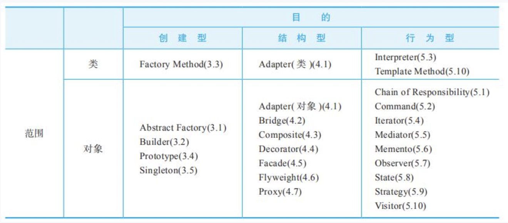

设计模式分为三种类型，共23种：
* 创建型模式：
创建型模式与对象的创建有关
    - 单例模式
    - 抽象工厂模式
    - 建造者模式
    - 工厂方法模式
    - 原型模式
* 结构性模式：
结构型模式处理类或对象的组合
    - 适配器模式
    - 桥接模式
    - 装饰模式
    - 组合模式
    - 外观模式
    - 享元模式
    - 代理模式
* 行为型模式
行为型模式对类或对象怎样交互和怎样分配职责进行描述。
    - 模版方法模式
    - 命令模式
    - 迭代器模式
    - 观察者模式
    - 中介者模式
    - 备忘录模式
    - 解释器模式
    - 状态模式
    - 策略模式
    - 责任链模式
    - 访问者模式

## 单一职责原则
- 就一个类而言，应该仅有一个引起它变化的原因
- 如果一个类承担的职责过多，就等于把这些职责耦合在一起，一个职责的变化可能会削弱或者抑制这个类完成其他职责的能力。这种耦合会导致脆弱的设计，当变化发生时，设计会遭受到意想不到的破坏
- 软件设计真正要做的许多内容，就是发现职责并把那些职责相互分离
- 如果你能够想到多于一个的动机去改变一个类，那么这个类就具有多于一个的职责
## 开放封闭原则
- 对于扩展是开放的（Open for extension）对于更改是封闭的（Closed for modification）
- 开放-封闭原则是面向对象设计的核心所在。遵循这个原则可以带来面向对象技术所声称的巨大好处，也就是可维护、可扩展、可复用、灵活性好。开发人员应该仅对程序中呈现出频繁变化的那些部分做出抽象，然而，对于应用程序中的每个部分都刻意地进行抽象同样不是一个好主意。拒绝不成熟的抽象和抽象本身一样重要
## 依赖倒转原则
- 抽象不应该依赖细节，细节应该依赖于抽象，即针对接口编程，不要对实现编程。
- 高层模块不应该依赖低层模块。两个都应该依赖抽象。
- 抽象不应该依赖细节。细节应该依赖抽象。
## 里氏代换原则
- 一个软件实体如果使用的是一个父类的话，那么一定适用于其子类，而且它察觉不出父类对象和子类对象的区别。也就是说，在软件里面，把父类都替换成它的子类，程序的行为没有变化
- 子类型必须能够替换掉它们的父类型。
- 只有当子类可以替换掉父类，软件单位的功能不受到影响时，父类才能真正被复用，而子类也能够在父类的基础上增加新的行为。
## 迪米特法则（最少知识原则）
- 如果两个类不必彼此直接通信，那么这两个类就不应当发生直接的相互作用。如果其中一个类需要调用另一个类的某一个方法的话，可以通过第三者转发这个调用。
- 迪米特法则其根本思想，是强调了类之间的松耦合。
- 在类的结构设计上，每一个类都应当尽量降低成员的访问权限，也就是说，一个类包装好自己的private状态，不需要让别的类知道的字段或行为就不要公开。
- 类之间的耦合越弱，越有利于复用，一个处在弱耦合的类被修改，不会对有关系的类造成波及。也就是说，信息的隐藏促进了软件的复用。
## 合成／聚合复用原则
- 合成／聚合复用原则（CARP）​，尽量使用合成／聚合，尽量不要使用类继承。​
- 聚合表示一种弱的‘拥有’关系，体现的是A对象可以包含B对象，但B对象不是A对象的一部分；合成则是一种强的‘拥有’关系，体现了严格的部分和整体的关系，部分和整体的生命周期一样。
- 合成／聚合复用原则的好处是，优先使用对象的合成/聚合将有助于你保持每个类被封装，并被集中在单个任务上。这样类和类继承层次会保持较小规模，并且不太可能增长为不可控制的庞然大物。
## 注意
- 设计模式的两大主题是"系统复用与系统扩展",这反映了软件设计模式的核心目标。系统复用强调代码的重用性,通过设计模式可以提供可重复使用的面向对象设计方案;系统扩展则强调软件的可扩展性,使系统能够在需求变化时方便地进行功能扩展。
- 面向服务的架构(SOA)通过松耦合和重用的方式来提高业务敏捷性是最恰当的选择。
    - 松耦合使得服务之间的依赖度降低,各个服务可以独立演化和修改,而不会对其他服务造成影响。这种低耦合性让系统更容易适应业务变化。
    - 重用则让已开发的服务能够被多个业务流程复用,避免重复开发,提高开发效率。服务可以作为可重用的业务功能组件,在不同场景下组合使用。
- 行为类模式主要通过继承机制在类之间分派和组织行为。在行为型模式中,继承机制用于定义算法和控制的骨架,子类通过继承来实现具体的行为。
- Spring框架常用模式：单例模式、代理模式、模板方法、观察者模式、工厂模式、适配器模式
- 面向对象设计有六大基本原则,通常称为SOLID原则。

SOLID原则包括:
    - 单一职责原则(Single Responsibility Principle)
    - 开放封闭原则(Open Closed Principle)
    - 里氏替换原则(Liskov Substitution Principle)
    - 接口隔离原则(Interface Segregation Principle)
    - 依赖倒置原则(Dependency Inversion Principle)
    - 迪米特法则(Law of Demeter)
