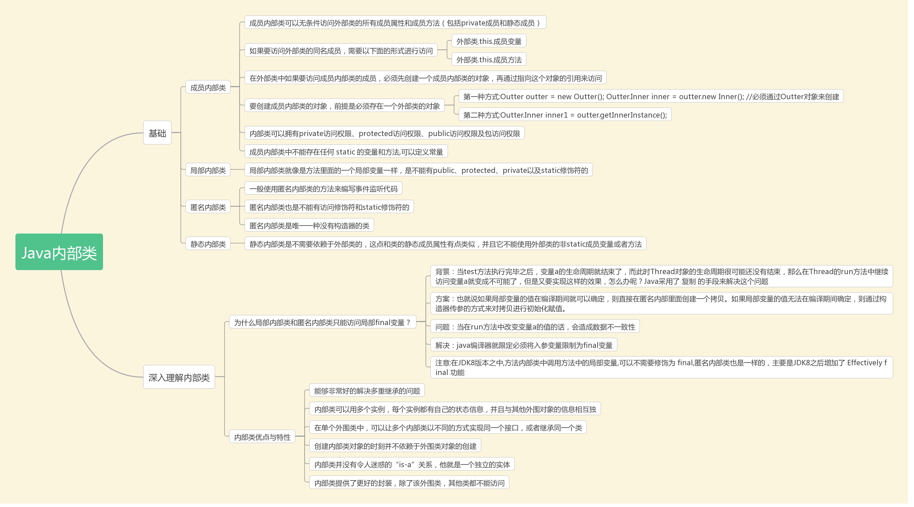
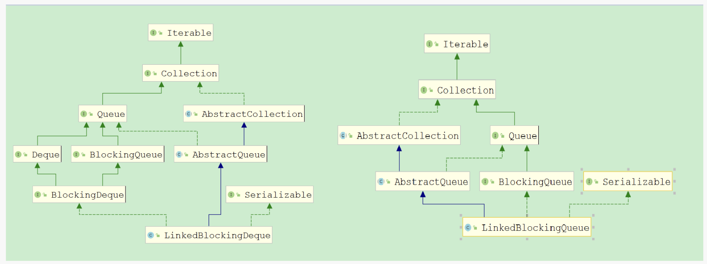

## 题目
1.类的初始化过程：
* 初始化父类的静态变量和静态代码块
* 初始化子类的静态变量和静态代码块
* 初始化父类的普通成员变量和代码块，再执行父类的构造函数
* 初始化子类的普通成员变量和代码块，再执行子类的构造函数

2.GB2312编码中，一个汉字占两个字节，Java中的char类型的16为Unicode字符，所以可以存GB2312编码下的一个汉字。

char类型在Java中是一个16位的Unicode字符类型,表示范围是从0到65535(十六进制为0x0000到0xFFFF)。

3. 正则匹配  

| 符号 | 描述 |
|------|------|
| `\b`   | 匹配一个字边界，即字与空格间的位置。例如，`er\b` 匹配 "never" 中的 "er"，但不匹配 "verb" 中的 "er"。 |
| `\B`   | 非字边界匹配。`er\B` 匹配 "verb" 中的 "er"，但不匹配 "never" 中的 "er"。 |
| `\cX`  | 匹配 `X` 指示的控制字符。例如，`\cM` 匹配 Control-M 或回车符。`X` 的值必须在 A-Z 或 a-z 之间。 |
| `\d`   | 数字字符匹配。等效于 `[0-9]`。 |
| `\D`   | 非数字字符匹配。等效于 `[^0-9]`。 |
| `\f`   | 换页符匹配。等效于 `\x0c` 和 `\cL`。 |
| `\n`   | 换行符匹配。等效于 `\x0a` 和 `\cJ`。 |
| `\r`   | 匹配一个回车符。等效于 `\x0d` 和 `\cM`。 |
| `\s`   | 匹配任何空白字符，包括空格、制表符、换页符等。等效于 `[ \f\n\r\t\v]`。 |
| `\S`   | 匹配任何非空白字符。等效于 `[^ \f\n\r\t\v]`。 |
| `\t`   | 制表符匹配。等效于 `\x09` 和 `\cI`。 |
| `\v`   | 垂直制表符匹配。等效于 `\x0b` 和 `\cK`。 |
| `\w`   | 匹配任何单词字符，包括下划线。等效于 `[A-Za-z0-9_]`。 |
| `\W`   | 匹配任何非单词字符。等效于 `[^A-Za-z0-9_]`。 |


4.java中，List允许包含重复元素，Set不允许包含重复元素。并非所有Set都是无序的。HashSet是无序的，TreeSet是有序的，LinkedHashSet是按插入顺序排序的。

5.抽象类是is-a的关系，接口是has-a的关系。

6. 抽象类和接口的知识点
* 接口可以继承接口，而且可以继承多个接口，但是不能实现接口，因为接口中的方法全部是抽象的，无法实现； 
-> 如果是Java 7以及以前的版本，那么接口中可以包含的内容有：1. 常量；2. 抽象方法
-> 如果是Java 8，还可以额外包含有：3. 默认方法；4. 静态方法
-> 如果是Java 9，还可以额外包含有：5. 私有方法
* 普通类可以实现接口，并且可以实现多个接口，但是只能继承一个类，这个类可以是抽象类也可以是普通类，如果继承抽象类，必须实现抽象类中的所有抽象方法，否则这个普通类必须设置为抽象类； 
* 抽象类可以实现接口，可以继承具体类，可以继承抽象类，也可以继承有构造器的实体类。 
* 抽象类中可以有静态main方法；抽象类里可以没有抽象方法，没有抽象方法的抽象类就是不想让别人实例化它； 
* 抽象类可以有构造方法，只是不能直接创建抽象类的实例对象而已。在继承了抽象类的子类中通过super(参数列表)调用抽象类中的构造方法，可以用于实例化抽象类的字段。 
* 接口方法的修饰符使用有严格限制，主要是为了保持接口作为行为契约的纯粹性和公开性。在Java 8中，接口方法可以是public、default、static，但不能是private或protected。
* 抽象类更像是一个不完整的类,它可以包含构造方法、普通成员变量、抽象方法和普通方法。而接口更像是一个行为的规范,只能包含常量、抽象方法(Java 8前)、默认方法和静态方法(Java 8后)。

7. 常见的抽象类与接口的区别： 
* 抽象类和接口都不能直接实例化，如果要实例化，抽象类变量必须指向实现所有抽象方法的子类对象，接口变量必须指向实现所有接口方法的类对象； 
* 接口只能做方法申明，抽象类中可以做方法申明，也可以做方法实现（java8中 接口可以有实现方法 使用default修饰）； 
* 接口里定义的变量只能是公共的静态的常量，抽象类中的变量是普通变量； 
* 抽象类里的抽象方法必须全部被子类所实现，如果子类不能全部实现父类抽象方法，那么该子类只能是抽象类。同样，一个类实现接口的时候，如不能全部实现接口方法，那么该类也只能为抽象类； 
* 抽象方法要被实现，所以不能是静态static的，也不能是私有private的，也不能被final修饰（试想一下，静态方法可以被类名直接调用，而类名直接调用一个没有实现的抽象方法没有意义）。 
* abstract不能与final并列修饰同一个类
* abstract方法可以在abstract类中，也可以在接口中。


8. java 垃圾回收机制
* Java堆内存采用分代结构，分为新生代（Young Generation）和老年代（Old Generation）。新生代进一步分为Eden区和两个Survivor区（S0和S1）。
* 虽然大多数新对象会在Eden区分配，但大对象（通过JVM参数-XX:PretenureSizeThreshold设置）会直接分配到老年代，避免在Eden区频繁复制。因此，对象并非“总是”在Eden区分配。
* 在Minor GC（YGC）时，若存活对象无法全部放入To Survivor区，超出的部分会直接晋升到老年代。
* 老年代内存使用率达到阈值时，并不直接触发Full GC。例如：
-> CMS收集器：当老年代使用率超过-XX:CMSInitiatingOccupancyFraction阈值时，触发的是并发标记周期（非Full GC），仅在并发失败时转为Full GC。
-> Parallel收集器：老年代空间不足时才会触发Full GC。
* Java垃圾回收器会自动回收不再使用的对象所占用的堆内存空间,而不是方法调用完成后的内存资源。方法调用结束后,其栈帧会自动从虚拟机栈中弹出,这个过程是由Java虚拟机(JVM)直接管理的,与垃圾回收器无关。

* 具体分析:
    1. 方法调用内存管理:
    - 每个方法调用都会在虚拟机栈中创建一个栈帧
    - 方法执行完毕后,栈帧自动弹出并释放相应的内存空间
- 这个过程是JVM自动完成的,不需要垃圾回收器参与

    2. 垃圾回收器的职责:
    - 主要负责回收堆内存中不再被引用的对象
    - 不负责处理虚拟机栈、本地方法栈等内存区域
    - 通过可达性分析等算法识别并回收垃圾对象

* GC不仅管理堆内存，还涉及方法区（元空间）
* Java GC是可以手动触发的，比如通过System.gc()方法，尽管这只是建议JVM进行垃圾回收，但并不保证一定会执行。JVM确实可以自主决定何时触发GC。
* 常见的GC算法：
    - 标记-清除(Mark-Sweep)：标记存活对象，清除垃圾对象
    - 标记-压缩(Mark-Compact)：标记存活对象，并将它们压缩到内存的一端
    - 复制移动(Copying)：将存活对象复制到另一块内存区域
    - 分代收集(Generational)：根据对象存活时间将内存分为新生代、老年代等，采用不同的回收策略
* 新创建的对象通常都是在Eden区分配，当Eden区空间不足时，就会触发Minor GC（新生代垃圾回收）。
* 新生代串行收集器(Serial)使用复制算法将Eden区和一个Survivor区的存活对象复制到另一个Survivor区。
* 新生代并行回收收集器(ParNew)本质上是Serial收集器的多线程版本,同样采用复制算法进行垃圾回收。
* 老年代串行收集器使用的是标记-整理算法，老年代并行回收收集器(Parallel Old)采用的是标记-整理算法。
*  CMS(Concurrent Mark Sweep)收集器采用的是标记-清除算法。


9. java的4类流程控制语句
循环语句：for，while，do-while
选择语句：if-else，switch
跳转语句：break，continue
异常处理语句：try-catch-finally，throw

10.java字符串
* 四个将两个字符串合并成一个字符串的函数

| 方法            | 线程安全 | 性能 | 适用场景 |
|-----------------|----------|------|----------|
| String.join()   | 是（底层同步） | 中  | 需分隔符的少量字符串合并 |
| String.concat() | 否       | 低  | 简单的两字符串合并 |
| StringBuilder   | 否       | 高  | 高频拼接（如循环中） |
| StringBuffer    | 是       | 中  | 多线程环境下的高频拼接 |
* equals()方法比较的是字符串的内容
* ==运算符比较的是对象的引用

11.jvm命令
* jmap：生成JVM堆转储快照（heap dump），并提供堆内存的详细信息，包括对象分布、内存使用率、垃圾收集器配置等。
* info：查看或修改JVM运行时参数（如系统属性、启动参数），不涉及内存映像。
* jhat：分析已生成的堆转储文件（如.hprof），提供HTTP服务展示内存分析结果，但本身不生成内存映像。
* jstat：监控JVM运行时统计信息（如GC次数、堆内存使用率），仅提供动态数据，不生成完整内存映像。
* JVM的内存配置参数
-Xmx10240m -Xms10240m -Xmn5120m -XXSurvivorRatio=3

  -Xmx：表示虚拟机的最大可用内存， 

  -Xms表示虚拟机的最小可用内存 ，

  -Xmn表示年轻代大小。由一个Eden区与两个Survivor区组成。

   -XXSurvivorRatio=3，表示一个Eden区与一个Survivor区的比值为3：1. 总份数 = 3 (Eden) + 1 (Survivor1) + 1 (Survivor2) = 5份，每份大小 =5120 MB / 5 = 1024 MB，所以Survivor区总大小：1024 MB*2=2048M。


12. 变量初始化
在Java中，final变量(成员变量)必须在以下位置之一进行初始化：
* 声明时直接初始化
* 在构造方法中初始化
* 在初始化块中初始化

13. 线程的启动
* 当调用t.run()时,方法会在当前线程(main线程)中执行,而不是启动新线程。这相当于普通的方法调用。
* 使用t.start()方法。这样才会创建新的线程。

14.Collection接口定义的方法包括size()、containsAll()、remove()等，而compareTo()方法属于Comparable接口，并非Collection接口的方法。

15.被static修饰的方法中不能有this和super关键字，因为static方法被调用时，该类的对象可能还没有被创建，也就无法确定调用的是哪个对象。

16.不管使用Character.toString()还是String.valueOf(),它们都会保持字符的可读形式,而不会转换为ASCII码值。如果想要得到字符的ASCII码值,需要使用(int)强制类型转换。

17. HashMap和Hashtable
* HashMap和Hashtable都是基于哈希表实现的Map接口，都使用key-value方式存储和获取数据。
* HashMap是非同步的，适合单线程环境，性能较好；Hashtable是同步的，适合多线程环境，但性能相对较差。
* HashMap采用了fail-fast机制进行快速迭代，而Hashtable使用Enumeration进行迭代，相对较慢。
* HashMap允许null值作为key和value，而Hashtable不允许null值作为key和value。

18.java线程的状态
线程可以有6种状态：new、runnable、blocked、waiting、timed waiting、terminated

19.java中的锁
* 根据线程获取锁的抢占机制,锁可以分为公平锁和非公平锁。根据锁只能被单个线程持有还是能被多个线程共同持有，锁可以分为独占锁和共享锁。
* ReadWriteLock允许一个资源可以被多线程同时进行读操作,ReentrantLock是以独占方式实现的。
* synchronized锁和ReentrantLock锁都可以锁重入。synchronized锁是非公平锁，而ReentrantLock可以通过修改参数来实现公平锁。synchronized不能被主动打断，ReentrantLock锁可以。synchronized不支持多个条件变量，而ReentrantLocK可以调用newCondition方法实现多个条件变量。
* synchronized可以用于修饰以下几种情况:
    * 修饰实例方法,锁定当前对象实例
    * 修饰静态方法,锁定当前类对象
    * 修饰代码块,锁定指定对象
* 这种锁机制确保了在同一时刻只有一个线程可以执行被synchronized保护的代码,从而保证了线程安全。

20.
* Java是纯面向对象语言，所有代码必须定义在类中，不存在独立的“过程”或“函数”。
* 方法必须隶属于类或对象，不能单独存在。
* 非静态方法属于实例成员（对象），而静态方法才属于类成员。
* 虽然Java方法必须属于类或对象，但调用方式与C/C++不同：Java需通过类名（静态方法）或对象（实例方法）调用。C/C++允许独立调用函数或过程。

21.java静态变量
* Java中静态变量只能在类主体中定义，不能在方法中定义。
* 静态变量属于类所有而不属于方法。  

22. 当比较引用类型时比较的是引用地址，而基本类型比较的是具体的值。在比较时要注意数据类型的匹配问题。

23.在Java中,finally块中的代码一定会执行,且会覆盖try或catch块中的返回值。执行顺序是:
* 首先执行try块中的代码
* 如果发生异常则执行catch块
* 最后一定会执行finally块
* 当try或catch块中的return语句被执行时，return值会被暂存，finally块中的代码不会改变这个返回值，但finally块中的代码一定会被执行。

    * finally块中的代码总是会执行,即使try或catch块中抛出了异常
    * 如果catch块中抛出新异常且未被捕获,则在finally块执行完后程序会终止
    * finally块后的代码只有在整个try-catch-finally结构正常执行完毕后才会执行。

24. java中的sleep和wait方法
* sleep是Thread类的静态方法，而wait是Object类的方法。
* sleep不会释放对象锁，而wait会释放对象锁。
* sleep使线程暂停执行指定时间，期间线程的监控状态保持不变，时间到后线程会自动恢复运行。
* wait进入等待池后，即使该对象调用了notify方法，等待的线程也不会自动获得对象锁并进入运行状态。而是要和其他竞争线程一起参与锁的竞争，只有竞争到锁才能继续执行。
* wait必须在同步块中使用，而sleep可以在任何地方使用。
* wait通常用于线程间协作，而sleep通常用于暂停线程执行
* wait后如果没有notify/notifyAll，线程会一直等待，而sleep会在指定时间后自动恢复。

25. Java多态的特性：
* 编译时多态：编译器根据引用类型决定可以调用哪些方法
* 运行时多态：如果方法被重写,则实际执行时根据对象的实际类型决定调用哪个版本的方法。静态方法不支持运行时多态。

26. Http相关接口
* 读取路径信息应该使用HttpServletRequest接口的方法,如getRequestURI()、getContextPath()、getServletPath()等。
* 设置HTTP头标，设置Cookie，输出返回数据使用HttpServletResponse接口的方法。
* 这体现了Servlet API中请求和响应职责的明确分工 - HttpServletRequest负责获取请求信息,HttpServletResponse负责生成响应。

27. 关于语句 A a = new A(); 的运行过程，正确的顺序是：
* 在栈内存分配变量 a 的空间（类型为 A 的引用变量，存储对象的地址）。
* 在堆内存分配存储空间（为 A 的对象分配内存）。
* 在分配好的堆内存空间实例化 A 对象（初始化成员变量并执行构造函数）。
* 将 a 变量指向分配的堆内存地址（引用变量 a 存储堆内存地址，指向对象）。
    * 关键分析：
    * 栈分配优先：声明 A a 时，栈内存会先分配空间给引用变量 a（此时 a 未指向任何对象）。
    * 堆分配与实例化：new A() 触发堆内存分配，随后在堆中完成对象初始化（包括默认值赋值和构造函数执行）。
    * 引用赋值最后：对象初始化完成后，堆内存地址才会赋给栈中的变量 a。

28.SDK(Software Development Kit)是软件开发工具包的统称,包含了开发某种软件需要的各种工具。

JDK(Java Development Kit)是Java开发工具包,包含了Java开发所需的编译器、调试器等开发工具,以及JRE。它是Java开发的标准工具集。

JRE(Java Runtime Environment)是Java运行环境,包含了Java虚拟机(JVM)、核心类库等运行Java程序所需的基本组件。

29.只有对变量的简单赋值(如x=1)是原子操作,不需要同步。而涉及到读取-修改-写回这样的复合操作,都需要通过同步机制(如synchronized、原子类等)来保证线程安全。这是因为复合操作在执行过程中可能被其他线程打断,导致数据不一致。

30.基本数据类型
* 从低到高可以进行自动类型转换
* 从高到低需要显式类型转换
* byte类型进行乘法运算会自动提升为int类型

31.java-web
* web.xml是Java Web应用程序的核心配置文件,它必须放在WEB-INF目录下。WEB-INF是一个特殊的目录,浏览器无法直接访问该目录下的任何资源,这样可以保护web应用的配置信息和内部资源的安全性。
* conf目录通常用于存放Tomcat服务器的配置文件,而不是Web应用的配置文件。
* lib目录是WEB-INF下用于存放Web应用所依赖的JAR包的目录。
* classes目录是WEB-INF下用于存放编译后的class文件和资源文件的目录。

32. java内部类


33.volatile关键字
* volatile关键字是Java中用于保证线程安全的一种机制,主要用于保证变量在多线程环境下的可见性和有序性。
* volatile只能用于修饰变量,不能修饰方法和类。这是Java语法规定的使用范围。
* volatile不能完全替代锁机制。虽然volatile能保证可见性和有序性,但无法保证原子性,因此在需要互斥访问或原子操作的场景下,仍然需要使用synchronized等锁机制来实现线程安全。
* volatile变量在每次被线程访问时,都强制从主内存中重新读取最新的值,而不是使用线程工作内存中的值。这确保了多线程环境下的数据可见性。
* volatile的内存语义确实遵循happens-before原则。具体体现在:
    * 对volatile变量的写操作happens-before后续对该变量的读操作
    * volatile变量的写操作会强制将工作内存中的数据刷新到主内存
* volatile关键字可以禁止指令重排序。编译器和处理器在不改变程序执行结果的前提下可能会对指令进行重排序,但volatile关键字会在必要时插入内存屏障,保证执行顺序。
* volatile并不能保证线程安全。它只能保证可见性,不能保证原子性。例如count++这样的复合操作,volatile无法保证其线程安全,因为读取、加1、写入这三个操作不是原子的。要实现线程安全,还需要配合synchronized或者原子类等机制。

34.一个类想要抛出自定义异常类，必须继承Throwable类或其子类

35.java泛型
* Java的虚拟机不支持泛型，所有的泛型在编译阶段都会被擦除，变成普通的类和方法。
* 在编译阶段，所有的泛型类型参数都会被擦除，替换为其边界类型（如果没有指定边界，则替换为Object）。
* 在创建泛型对象时明确指定类型参数是一个很好的实践。这样编译器可以在编译阶段就进行类型检查，避免运行时出现类型转换异常。
* 类型擦除是Java泛型的重要特性，但这并不意味着完全无法获取泛型的类型信息。通过反射机制，我们依然可以在运行时获取到泛型的实际类型参数。

36.Java字符编码和国际化
* Java中的char类型确实是使用UTF-16编码的,默认采用Big Endian字节序。每个char固定占用2个字节(16位),可以表示基本多语言平面(BMP)中的所有字符。
* ResourceBundle是Java国际化最常用的工具类,它可以根据不同的Locale加载相应的资源文件,实现应用程序的多语言支持。通过ResourceBundle可以方便地管理不同语言的文本资源。
* 字符占用的字节数与具体的编码方案有关。在UTF-8编码中,英文字符占1个字节,而中文字符通常占3个字节；在GBK编码中,英文字符占1个字节,中文字符占2个字节。
* 数据库编码与网页编码可以不同。只要在读取数据时正确指定编码方式进行解码,再按照网页编码重新编码,就可以正确显示。这种编码转换在程序中是很常见的操作。

37.java多行注释/* */可以嵌套单行注释//,但是多行注释不能嵌套多行注释

38.java枚举
* 枚举可以定义实例方法、实例变量和构造函数。
* 枚举不能被其他类继承，也不能继承其他类。
* 枚举是Java中的一种特殊数据类型，用于定义一组固定常量。
* 枚举可以包含构造函数，但必须为私有（默认隐式私有）。
* 枚举类型本身 不能定义泛型参数，因为枚举常量是静态实例，而泛型类型擦除会导致运行时类型信息丢失。但枚举的方法中可以使用泛型。

39. throws关键字用于在方法声明中指明该方法可能抛出的检查型异常（非运行时异常）。这是一种异常声明机制，告知方法调用者需要处理这些可能的异常情况。

throw关键字用于在代码中显式地抛出一个异常对象。这是手动抛出异常的方式，可以抛出自定义的异常或系统预定义的异常。

40.类的构造函数
* 若未显式定义构造函数，Java编译器会默认生成无参构造函数。因此构造函数可以省略。
* 构造函数必须与类同名，但普通方法允许与类同名（需声明返回类型）。
* 构造函数在对象实例化（new）时自动调用。
* Java支持构造函数重载，一个类可定义多个参数不同的构造函数。
* 构造方法在代码块之后执行
* 构造方法用于对象初始化
* 构造方法在new对象时自动调用
* 构造方法没有返回值类型（不是void，而是完全没有）
* 构造方法的名称必须与类名相同

41.Java的I/O流可以分为:
* 字节流:以字节为单位处理数据,包括InputStream和OutputStream体系
* 字符流:以字符为单位处理数据,包括Reader和Writer体系

BufferedReader类读取字符串应该使用readLine()方法。read()方法是用来读取单个字符的，返回的是int类型的ASCII码值。如果要读取字符串，正确的方法是使用readLine()。

System.out实际上是PrintStream类的对象实例，而不是PrintWriter类的对象。print()和println()方法是由PrintStream类定义的。

FileInputStream确实是用于从文件读取数据的输入流，它是字节流的一种，可以使用new关键字创建对象。

File类中的mkdir()和mkdirs()方法都可以用来创建文件夹，其中：
- mkdir()方法用于创建单个目录
- mkdirs()方法用于创建多级目录，如果父目录不存在会自动创建父目录

42.java的体系结构

（1）Java编程语言:
- 是开发Java应用程序的基础
- 提供了简单、面向对象、分布式、健壮等特性
- 是程序员编写Java代码的直接工具

（2）Java类文件格式:
- 是源代码编译后的标准格式
- .class文件包含了字节码指令
- 实现了平台无关性的重要基础

（3）Java API:
- 提供了丰富的类库支持
- 包含了核心类库、扩展类库等
- 是开发Java应用程序的重要组件

（4）JVM(Java虚拟机):
- Java程序运行的平台
- 负责执行字节码
- 提供了内存管理、垃圾回收等机制

这四个部分紧密关联:
- 程序员使用Java语言编写代码
- 编译成类文件格式
- 调用Java API进行开发
- 最终在JVM上运行

43.在涉及不同数据类型运算时，较小精度的类型会自动提升为较大精度的类型，然后再进行运算。

44.类变量在不设置初始值时，会进行默认值赋值，而局部方法中声明的变量则必须进行初始化，他不会进行默认值赋值。   

45.Vector:它是线程安全的动态数组实现,其所有方法都被synchronized修饰,在多线程环境下可以安全使用。

Hashtable:也是线程安全的,其所有方法都使用synchronized进行同步,可以在多线程环境下安全地进行键值对操作。

Stack:继承自Vector类,因此具有Vector的线程安全特性,其push和pop等操作都是同步的。

46.访问权限修饰符的正确使用规则：
* 外部类：只能用public或默认
* 成员内部类：可以使用所有四种访问修饰符（public、protected、private和默认）
* 局部内部类：不能使用任何访问修饰符
* 匿名内部类：不能使用任何访问修饰符

47. 在Java中,Integer类型在-128到127之间的数值会被缓存。当我们创建这个范围内的Integer对象时,实际上是从缓存池中取出对象,所以这些对象是同一个实例。而超出这个范围的数值则会创建新的对象。
```java
Integer i01=59;
int i02=59;
Integer i03=Integer.valueOf(59);
Integer i04=new Integer(59);
```
* i01==i03结果为true，因为i01和i03都是Integer对象，值都是59。由于Integer有缓存机制，在-128到127之间的整数会被缓存，所以这两个引用指向同一个对象。
* i01==i02结果为true，因为当Integer对象与int类型比较时，会自动拆箱成int类型进行值比较。
* i02==i04结果为true，同样是因为Integer会自动拆箱为int类型进行值比较。
* i03==i04 结果为false，因为i03是通过`valueOf()`方法获得的Integer对象（使用缓存），而i04是通过new关键字创建的新对象，它们是两个不同的对象实例，虽然值相同，但地址不同，所以用 == 比较返回false。

值得注意的是：
    * Integer.valueOf()会优先使用缓存池中的对象
    * new Integer()每次都会创建新的对象
    * 当涉及到基本类型时，包装类会自动拆箱进行值比较
    * 使用equals()方法比较Integer对象时比较的是值而不是引用

48. 移位运算
- `>>` 是带符号右移，右移后左边补符号位（正数补0，负数补1）
- `>>>` 是无符号右移，右移后左边统一补0
- 每右移一位相当于除以2
- 如果是正数，`>>`和`>>>`的效果是一样的，都是补0

49. request
* request.getAttribute()方法是从request范围内获取存储对象的标准方法。在JavaWeb开发中,我们可以使用request.setAttribute()方法在request作用域中存储对象,然后通过getAttribute()方法获取这些对象。
* request.getRequestURL() - 该方法返回客户端请求的完整URL,而不是获取request范围内存储的对象。
* request.getParameter() - 该方法用于获取HTTP请求参数的值,通常用于获取表单提交的数据或URL中的查询参数,不是用来获取request范围内存储的对象。
* request.getWriter() - 该方法返回一个PrintWriter对象,用于向客户端发送字符响应,与获取request范围内的对象无关。

50. java异常
* Java的异常分为两大类：
    - 运行时异常(RuntimeException)：可以不做处理
    - 非运行时异常(编译时异常)：必须处理

* 非运行时异常的处理方式：
    - try-catch块捕获处理
    - throws关键字声明抛出
    - 两种方式必须选择其一，否则编译不通过

* 为什么必须处理非运行时异常：
    - 这类异常在编译阶段就能预见
    - 不处理可能导致严重后果
    - 编译器强制要求处理，否则报错

* 常见的非运行时异常例子：
    - IOException
    - SQLException
    - ClassNotFoundException

51. ServletConfig接口是由GenericServlet类默认实现的。GenericServlet是一个抽象类,它实现了Servlet和ServletConfig这两个接口,为所有Servlet提供了基础实现。

52. 线程相关
* 在多进程中，子进程通过fork()创建时会继承父进程的地址空间（包括堆和栈的副本，采用写时复制机制）。因此，子进程确实能获得父进程当时的堆和栈数据。
* 在多线程中，同一进程的线程共享全局变量、堆等数据，但每个线程拥有独立的栈空间。
* 线程的创建和切换开销远小于进程，因为线程共享进程资源（如内存），无需独立地址空间。
* 线程通过共享内存直接通信，无需跨进程的复杂机制（如管道、消息队列），速度更快。
* 线程切换仅需保存寄存器和栈指针，无需切换地址空间，因此切换成本更低。

53. TLS线程局部存储

TLS(线程局部存储)是一种特殊的存储机制，它为每个线程提供独立的变量副本。
* TLS是解决多线程访问冲突的一种技术。通过为每个线程提供独立的变量副本，避免了线程间的数据竞争，从而解决了并发访问冲突问题。
* TLS的核心特性。它会为每个线程创建并维护一个独立的变量副本，这些副本与特定线程绑定，其他线程无法访问。
* 虽然TLS为每个线程提供了独立的变量副本，但这并不意味着完全不需要同步。如果变量的操作涉及多个步骤，或者存在其他共享资源的访问，仍然可能需要同步机制。
* Java中的ThreadLocal类就是TLS技术的一个具体实现。它提供了创建线程局部变量的功能，使每个线程都拥有自己的变量副本。
* 总的来说，TLS是一种重要的并发编程技术，它通过为每个线程提供独立的变量副本来避免数据竞争。但要注意，它并不能解决所有的线程同步问题，在某些场景下仍需要使用其他同步机制。

54. 在Java中,静态方法不能直接访问非静态成员,这会导致编译错误。

55.byte类型是8位有符号整数,取值范围是-128到127。当b += a执行时:
* b的初始值是127(byte最大值)
* b += a 相当于 b = (byte)(b + a)
* 127 + 1 = 128,超出了byte的最大值127
* 由于byte是循环存储的,当超过127后会从最小值-128重新开始
* 所以最终b的值为-128

56. Java中所有异常和错误的基类是java.lang.Throwable，其中:
- Error和Exception都继承自Throwable
- RuntimeException是Exception的子类

57. 针对循环优化的主要方法包括强度削弱、删除归纳变量和代码外提,这些都是有效的循环优化技术。

58. JDK1.8中的ConcurrentHashMap采用了数组+链表+红黑树的复合数据结构,这是其内部存储的基本架构。当哈希冲突时,会首先使用链表来存储,当链表长度超过阈值(默认为8)时,链表会转换为红黑树,以提高检索效率。

59. Kotlin可以使用库函数 arrayOf() 和 Array() 构造函数创建数组。

60. Thread.sleep()方法确实会抛出checked exception(已检查异常),即InterruptedException。这是因为:
* sleep()方法可能会被中断,当线程在休眠期间被其他线程调用interrupt()方法时,就会抛出InterruptedException。
* 在Java中,InterruptedException属于checked exception(已检查异常)的一种,所以调用Thread.sleep()时必须:
    - 要么使用try-catch块捕获异常
    - 要么在方法签名中使用throws声明抛出异常

61.final类型
Java中使用final修饰类的主要目的是出于安全考虑，防止类被继承后改变其原有的行为。
- String类设计成final是因为它被广泛用于类加载机制和安全机制中，且其不可变性是很多设计的基础。
- StringBuffer设计成final主要是因为它的线程安全特性需要得到保证。

62.守护线程和join
* setDaemon(true)必须在线程启动前调用，这是由Java线程的生命周期决定的。一旦线程启动后，就不能再修改它的守护线程状态。
* join()方法是用来等待线程结束的，它的调用位置应该在需要等待的线程代码中，而不是必须在start()之前。实际上，join()通常在start()之后调用，因为它的作用是等待目标线程执行完成。
* 守护线程是为其他线程服务的线程，当所有非守护线程结束时，守护线程会自动终止
* join()方法常用于线程同步，可以让一个线程等待另一个线程完成后再继续执行。

63. 线程的yield和sleep
* yield方法调用后,只是让当前线程让出CPU执行权,但不一定会发生线程切换。如果没有其他相同优先级的线程在等待CPU资源,该线程可能会继续执行。
* yield方法并不会导致线程暂停指定时间,它只是一个提示性的方法,建议让出CPU时间片。yield之后线程会直接进入就绪状态,随时可能再次获得CPU执行权。
* yield方法执行后,线程从running状态转为ready(就绪)状态,而不是waiting状态。这是一个重要的状态转换概念。
* sleep会使线程进入计时等待状态,yield只是让线程回到就绪状态
* sleep一定会发生线程切换,而yield不一定
* sleep会暂停指定时间,而yield只是建议性让出CPU
* sleep会使线程进入TIMED_WAITING状态,而yield会使线程进入READY状态。

64. 字符串的intern方法
```java
public static void main(String[] args) {
    String str1 = "Hello";
    String str2 = new String("Hello");
    str2 = str2.intern();
    System.out.println(str1 == str2);
}
```

intern()方法会首先检查字符串常量池中是否存在"Hello"
    - 由于第1步已经在常量池中创建了"Hello",所以intern()会直接返回常量池中的这个对象的引用
    - str2被重新赋值,现在也指向常量池中的"Hello"对象

65. ArrayList和LinkedList各有优缺点，ArrayList适合随机访问和遍历操作，LinkedList适合频繁的插入和删除操作。
* ArrayList是Java中最常用的集合类之一,ArrayList维护了元素的插入顺序。ArrayList内部使用数组实现,按照元素添加的顺序存储,我们可以通过索引顺序访问元素。
* ArrayList不是不可变的(immutable)。我们可以添加、删除、修改ArrayList中的元素。
* ArrayList允许重复元素,不保证元素唯一性。如果需要保证元素唯一,应该使用HashSet。
* ArrayList中的元素是通过数字索引(index)访问的,而不是通过键(key)。使用键值对访问是Map接口的特性。
* ArrayList不是线程安全的,也就是说不保证同步(synchronized)。如果需要线程安全的ArrayList,可以使用Collections.synchronizedList()方法将其包装成同步集合。
* LinkedList 实现了 Deque 接口，可作为队列使用；实现了 List 接口，可进行列表的相关操作。实现了 Cloneable 接口，可实现克隆;实现了 java.io.Serializable 接口，即可支持序列化，能通过序列化去传输。同时LinekdList也继承了 AbstractSequentialList 类。


66.分区段加锁是提高容器类数据结构并发访问性能的最佳方案。这种方法通过将数据结构分成多个区段,每个区段使用独立的锁,可以显著提高并发性能,因为不同线程可以同时访问不同的区段。典型的实现如ConcurrentHashMap就采用了这种方案。
* 分区段加锁的优势在于:
    * 细粒度的锁控制,减少锁竞争
    * 多个线程可以并发访问不同的数据段
    * 读写都能获得不错的性能
    * 内存占用合理
    * 适用于读写频繁的场景

67.默认情况下，equals() 方法与 == 运算符的作用相同，即比较两个对象的引用是否相等。Object类中equals方法的实现也是使用的`==``，很多类equals方法会比较内容是因为重写了该方法。

68.java反射
* Class类位于 java.lang 包
* Method、Field等类位于 java.lang.reflect 包
* 反射机制仅支持运行时访问和操作类信息（如调用方法、访问字段），无法修改字节码。
* 字节码修改需依赖其他技术（如 ASM、Javassist 或 Java Agent）。
* 即使缓存Method/Field对象，反射调用（如method.invoke()）仍比直接调用慢数倍。
* JVM 无法对反射调用进行完全优化（如方法内联、访问权限检查无法省略）。

69. &和｜是非短路运算符，左和右式都会被执行
&&和｜｜是短路运算符，对于&&来说，表达式一位假，表达式二不执行。 对于｜｜来说，表达式一为真，表达式二不执行。 

70.JVM内存
* 方法区(Method Area)是JVM中一片线程共享的内存区域,方法区存储的是所有线程都需要访问的公共信息,包括类信息、常量、静态变量等,这些信息需要被所有线程共享访问。
* 程序计数器(Program Counter Register)是线程私有的一块小内存区域,用于记录线程执行的字节码行号指示器。每条线程都需要一个独立的程序计数器来保证线程切换后能恢复到正确的执行位置。
* 虚拟机栈(VM Stack)是线程私有的,它的生命周期与线程相同。每个方法在执行时都会创建一个栈帧,用于存储局部变量表、操作数栈、动态链接、方法出口等信息。
* Java堆(Heap)是所有线程共享的一块内存区域,几乎所有的对象实例都在这里分配内存。Java堆可以处于物理上不连续的内存空间,但在逻辑上它应该被视为连续的。
* 总的来说,JVM中线程隔离的区域包括程序计数器、虚拟机栈和本地方法栈,而线程共享的区域包括Java堆和方法区。

71.Java 中方法参数传递是 按值传递，对象引用作为值传递的是引用的副本。

72.java AWT

TextField作为文本框组件的主要特点包括:
* 支持文本输入和编辑
* 可以设置文本框的大小和位置
* 可以响应文本变化事件
* 可以设置是否支持编辑、是否可见等属性
* 可以通过getText()和setText()方法获取和设置文本内容

73.java的跨平台特性

Java的跨平台特性指的是Java程序编译后的字节码(.class文件)可以在不同的操作系统平台上运行,而不是源代码可以直接在多个平台运行。
* Java程序的执行过程是:
    - 源代码(.java文件)首先被编译成字节码(.class文件)
    - 字节码文件在不同平台的JVM(Java虚拟机)上运行
    - JVM负责将字节码转换成对应平台的机器码

* Java实现跨平台的关键在于:
    - 统一的字节码格式
    - 不同平台都有对应的JVM实现
    - JVM屏蔽了底层操作系统的差异


74. String类的构造函数

String(char[] value, int offset, int count) 构造函数的作用是从字符数组的指定位置提取子字符串
* offset是起始索引
* count是连续取多少个字符

String类的replace()方法会返回一个新的字符串对象，而不会修改原有字符串的内容。

75.subSet函数
```java
TreeSet<Integer> set = new TreeSet<Integer>();
TreeSet<Integer> subSet = new TreeSet<Integer>();
for(int i=606;i<613;i++){
    if(i%2==0){
     set.add(i);
     }
 }
subSet = (TreeSet)set.subSet(608,true,611,true);
set.add(609);
System.out.println(set+" "+subSet);
```
* subSet是指向原数据的，原数据修改，subSet也跟着修改。 
* subset(form，true，to，true)是TreeSet的非静态方法，该方法返回从form元素到to元素的一个set集合，两个boolean类型是确认是否包含边境值用的.

76.java泛型
* 泛型类型参数必须是引用类型，不能使用基本类型（如int、char等）。若需使用基本类型，必须用对应的包装类（如Integer、Character）。 
* Java 泛型采用类型擦除（Type Erasure） 机制，即泛型信息在编译后会被删除，运行时无法获取具体的泛型类型参数。 
* Java 不允许创建具体参数化类型的数组，因为数组在创建时需要知道其确切类型，而泛型的类型擦除会导致运行时类型信息丢失，可能引发类型安全问题。 
    *在 Java 中，参数化类型的数组指的是直接使用具体泛型类型（如`List<String>`、`Map<Integer, String>`等）创建的数组
```java
List<String>[] stringLists = new List<String>[10]; // 编译错误：Cannot create a generic array of List<String>

// 若允许这样创建，可能引发以下问题：
Object[] objArray = stringLists;
objArray[0] = new ArrayList<Integer>(); // 运行时ArrayStoreException（但由于编译错误，无法触发）
```
* 泛型类型变量（如T）在运行时无法直接实例化，因为 Java 编译器在编译时会擦除泛型类型信息，无法确定具体类型。

77.LinkedBlockingDeque类和LinkedBlockingQueue类

LinkedBlockingDeque是基于链表的、线程安全的双端阻塞队列。LinkedBlockingQueue是基于链表的先进先出的阻塞队列。两者共同特点如下：
* 链表结构（动态数组）
* 通过ReentrantLock实现锁
* 利用Condition实现队列的阻塞等待，唤醒

阻塞队列成员中的元素有界性区别如下表格：

| 队列                  | 有界性                   |
|-----------------------|--------------------------|
| ArrayBlockingQueue    | 有界 (bounded)           |
| LinkedBlockingQueue   | 可选有界 (optionally)    |
| PriorityBlockingQueue | 无界 (unbounded)         |
| DelayQueue            | 无界 (unbounded)         |
| SynchronousQueue      | 有界 (bounded)           |
| LinkedTransferQueue   | 无界 (unbounded)         |
| LinkedBlockingDeque   | 无界 (unbounded)         |

* LinkedBlockingQueue是一个可选有界队列，确实不允许null值。当创建时不指定容量时为无界队列，指定容量时则为有界队列。且它的add()、put()等方法都会对null值进行检查并抛出NullPointerException。
* PriorityQueue是基于优先级堆的无界优先级队列，不允许插入null值，其入队(offer/add)和出队(poll/remove)操作的时间复杂度确实是O(log(n))，因为需要维护堆的特性。
* LinkedBlockingQueue是线程安全的阻塞队列，它的操作都是通过ReentrantLock来保证线程安全。而PriorityQueue是非线程安全的。
* ConcurrentLinkedQueue遵循FIFO原则，但PriorityQueue不遵循FIFO原则。PriorityQueue是按照优先级来确定出队顺序，每次出队都会取出优先级最高（通常是最小值）的元素，而不是先进先出。

78.Java中的局部变量在使用前必须明确赋值，编译器会进行严格的变量初始化检查

79.Socket
服务器端的典型操作流程是：
* 创建ServerSocket
* 调用accept()等待客户端连接
* 获取输入输出流进行数据交换
* 完成后调用close()关闭连接

* Socket类是用于客户端创建连接的,不能用于服务器端监听。这种构造方法会尝试连接到指定主机和端口,而不是进行监听。
* ServerSocket的构造方法不接受主机名参数。服务器套接字在创建时只需要指定要监听的端口号即可。
* 服务器端首先要通过new ServerSocket()创建服务器套接字对象,然后调用accept()方法获取与客户端通信的Socket对象,而不是直接通过new ServerSocket()创建通信的Socket对象。
* 客户端是通过new Socket()方法来创建通信的Socket对象。

80.重写和重载的区别

| 特性       | 重载 (Overloading)           | 重写 (Overriding)                     |
|------------|-----------------------------|---------------------------------------|
| 作用范围   | 同一个类                     | 子类继承父类                           |
| 参数列表   | 必须不同                     | 必须相同                               |
| 返回值     | 可不同                       | 必须相同或协变（子类型）               |
| 访问权限   | 可任意                       | 子类不能更严格                         |
| 异常       | 可任意                       | 子类不能抛出更宽泛的检查异常           |
| 多态类型   | 编译时多态                   | 运行时多态                             |

81.java类加载
Java类加载过程包含加载、验证、准备、解析和初始化这5个阶段。"int类型对象成员变量赋予默认值"属于对象实例化过程，而不是类加载过程。

类加载过程中包含:
* "生成java.lang.Class对象"属于加载阶段的工作，在这个阶段会将类的二进制数据读入内存，并生成对应的Class对象。
* "执行static块代码"属于初始化阶段的工作，这个阶段会执行类构造器()方法，包括静态变量赋值和静态代码块。
* "类方法解析"属于解析阶段的工作，这个阶段会将常量池内的符号引用替换为直接引用。

成员变量赋默认值是在对象实例化过程中进行的，具体来说是在对象内存分配之后、构造方法执行之前这个时间点。这个过程与类加载是不同的概念，类加载是针对类级别的处理，而对象成员变量赋值是针对具体对象实例的操作。

82.java的类加载器
* 引导类加载器是最顶层的类加载器,负责加载Java核心库(JAVA_HOME/jre/lib)中的类,如rt.jar等。它是用C++实现的,在Java中表现为null。Bootstrap类加载器由JVM本地代码实现，负责加载核心Java类库（如rt.jar），是虚拟机的一部分。
* 扩展类加载器负责加载Java扩展库,位于JAVA_HOME/jre/lib/ext目录下的JAR包。它是Java语言编写的,是引导类加载器的子类加载器。
* 系统类加载器(也称为应用类加载器)负责加载应用程序classpath路径下的类。它是扩展类加载器的子类加载器,是开发者最常用的类加载器。
* Tomcat为每个Web应用创建一个独立的类加载器实例,实现了类的隔离加载。这样不同的Web应用可以使用同名但不同版本的类库,避免类冲突。
* 所有ClassLoader（如ExtClassLoader、AppClassLoader及自定义加载器）均有父类加载器。即使父类在代码中表现为null（如ExtClassLoader的父类逻辑上是Bootstrap），仍符合双亲委派模型。
* ClassLoader采用继承的方式复用父类加载器

这四种类加载器共同组成了Java的类加载体系,遵循双亲委派模型:
    * 先将类加载请求委托给父类加载器
    * 父加载器无法加载时,子加载器才会尝试加载
    * 确保Java核心类库的安全性和一致性

83.请求转发
forward和redirect是Web开发中两种重要的请求转发机制。
* forward是服务器内部转发,在这个过程中浏览器是不知道服务器具体的处理细节的。当请求被forward到其他资源时,浏览器地址栏显示的仍然是原始请求的URL。
* redirect是一种重定向机制,服务器会返回3xx状态码(如302)和新的location,告诉浏览器需要重新发起对新地址的请求。
* forward是在服务器内部将请求转发给其他资源,整个过程对浏览器透明,这是内部重定向。而redirect需要浏览器重新发起请求,是一种外部重定向方式。
* forward时控制权并不是完全转交,原始请求对象仍然存在,可以共享请求数据。新的资源只是负责生成响应内容。
* redirect默认会产生302 Found(临时重定向)的HTTP响应,而不是301永久重定向。只有在特殊配置下才会返回301状态码。

总的来说,forward和redirect的主要区别在于:forward是服务器内部转发,地址栏不变;redirect是通过浏览器重新请求来实现转发,地址栏会改变。

84.java.sql是Java提供的标准JDBC（Java Database Connectivity）API包，它包含了访问和处理数据库所需的核心类和接口，如Connection、Statement、ResultSet等。这个包是Java程序连接数据库、执行SQL语句的基础。

85.CGI和Servlet
* CGI的移植性实际上不如Servlet。Servlet是基于Java的Web组件,具有"一次编写,到处运行"的特性,可以运行在任何支持Java的服务器上。而CGI程序虽然也可以用多种语言编写,但往往需要针对不同的操作系统和服务器环境进行修改和重新编译。
* Servlet在服务器进程中通过多线程方式运行service方法。每个请求由一个线程处理,这种机制比CGI更高效。
* CGI采用进程方式处理请求,每个请求都会创建新的进程,处理完成后进程就会被销毁。这种方式资源消耗较大。
* Servlet提供了丰富的API和工具类,能够方便地处理HTTP请求、响应、会话管理等常见Web开发任务。相比之下CGI需要自己处理这些细节。
* 总的来说,Servlet在性能、开发效率和跨平台特性上都优于CGI。它采用多线程而非多进程方式,提供了完善的Web开发框架,且具有很好的可移植性。

86.ResultSet中记录行第一列的索引为1,这是JDBC规范明确规定的。JDBC采用从1开始的列索引计数方式,这与数据库中的列计数方式保持一致。

87.replaceAll函数的第一个参数是正则表达式。"."在正则表达式中是一个特殊字符,表示匹配任意单个字符(除换行符外)。

88.ExecutorService关闭机制
* shutdown()方法会让线程池进入"关闭"状态,此时不再接受新的任务提交,但会继续执行队列中的任务直到完成。这是一种平缓的关闭方式。
* shutdown()方法不是阻塞方法,它仅仅是发出关闭信号后就立即返回。如果需要等待任务执行完成,需要配合使用awaitTermination()方法。
* shutdownNow()方法会尝试终止所有正在执行的任务,并返回等待执行的任务列表(List)。这些任务是尚未开始执行的任务。
* awaitTermination(long timeout, TimeUnit unit)是阻塞方法,它会等待直到以下三种情况之一发生:
    - 所有任务执行完成
    - 到达指定的超时时间
    - 当前线程被中断
    - 这个方法常用于确保线程池完全关闭。

89.在Java中:
- 向上转型(子类转父类)是自动和安全的
- 向下转型(父类转子类)需要显式转换,且只有当对象的实际类型是目标类型或其子类时才能成功,否则会抛出ClassCastException
* 赋值语句左边的类型要大于等于右边的类型。

90.HttpServlet类的service()方法是处理HTTP请求的核心方法。在扩展HttpServlet时,开发者应该至少重写一个doXXX()方法(如doGet()或doPost())来处理特定类型的HTTP请求。

91.在 Java 里，如果 if 不加大括号 {}，只有紧跟在它后面的第一条语句 会被视为属于 if 的代码块，其余的语句与 if 无关。

92.Spring框架
* Spring支持使用AOP进行日志操作,但是它需要集成第三方的日志框架如Log4j、SLF4J等。Spring只是提供了AOP的基础设施,让开发者能够使用AOP的方式来实现日志功能。
* Spring确实是一个支持快速开发Java EE应用的轻量级框架,它提供了很多便捷功能来简化企业级Java开发。
* 依赖注入(DI)是Spring框架的核心特性之一,它通过IoC容器来管理对象的依赖关系,降低了代码耦合度。
* Spring提供了声明式事务管理功能,开发者可以通过注解或XML配置的方式来管理事务,不需要编写大量的事务管理代码。

93.switch语句要求参数类型必须是能够进行精确值比较的类型。整数类型、字符类型、枚举类型和字符串类型都满足这个要求,而浮点型因为存在精度问题,所以不能作为switch语句的参数。

94.RMI (Remote Method Invocation)默认采用TCP/IP作为通信协议,这是因为:
* TCP/IP协议可以提供可靠的、面向连接的通信服务,能确保方法调用和返回值的准确传输。
* RMI需要在客户端和服务器之间建立持久的连接,进行双向通信,而TCP/IP的连接导向特性正好满足这一需求。
* TCP/IP具有错误检测和数据重传机制,保证了远程方法调用的数据完整性。

95.在Java中，声明二维数组的[][]可以有多种位置组合，比如int[][] a、int[] a[]、int a[][]都是合法的，但关键是在使用new时必须指定具体的维度大小。

96.在 Java 中，只要是参与加、减、乘、除运算的整数类型，如果是byte、short或char，都会自动被提升为int。

97.Object类

Object类默认提供的基本方法包括:
- equals(Object obj)方法:用于比较两个对象是否相等
- clone()方法:用于创建并返回对象的一个副本(注意这里是clone而不是copy)
- wait()方法:用于线程同步
- notify()/notifyAll()方法:用于线程唤醒
- toString()方法:返回对象的字符串表示
- hashCode()方法:返回对象的哈希码值
- getClass()方法:返回对象的运行时类

98.Java 中，子类（包括匿名内部类）无法直接访问父类的private成员。虽然匿名内部类定义在Main类内部，但它本质上是Main的子类，仍需遵循访问权限规则。


99.Maven和Ant
* Maven和Ant的本质区别在于构建工具的设计理念。只有Maven有生命周期(lifecycle)的概念,而Ant没有。
* Maven的生命周期是固定的,包含了清理、编译、测试、打包、集成测试、验证、部署等阶段。当执行某个阶段时,会自动按顺序执行之前的所有阶段。而Ant是过程式的构建工具,通过编写build.xml来定义一系列任务的执行顺序,这些任务之间可以有依赖关系,但并不是一个标准的生命周期概念。
* Ant没有标准的目录结构约定,需要在build.xml中明确指定源代码、资源文件等的位置。
* Maven遵循"约定优于配置"的原则,默认的项目结构是固定的,如src/main/java存放源代码,src/test/java存放测试代码等。
* Ant的默认构建文件是build.xml,Maven的默认构建文件是pom.xml,这是两个工具的基本配置文件。

100.ArrayList的扩容机制:
- 默认初始容量是10
- 当容量不足时,会扩容为原来的1.5倍
- 通过构造函数指定初始容量可以避免扩容，如下例子：
`ArrayList list = new ArrayList(20);`

101.在Java IO体系中,flush()方法是OutputStream类所特有的,用于刷新输出流并强制写出所有缓冲的输出字节。

102.java内部类
* 内部类可以直接访问外部类的所有成员(包括私有成员)。
* 当内部类和外部类存在同名成员时,默认情况下访问的是内部类的成员。如果要访问外部类的同名成员,需要使用"外部类名.this.成员名"的方式。

103.逻辑运算符左右两边必须是布尔类型

104.模版方法模式

优点：
* 提高复用性
* 提高扩展性
* 符合开闭原则

缺点：
* 类数目增加
* 增加了系统实现的复杂度
* 继承关系自身的缺点，如果父类添加新的抽象方法，所有子类都要改一遍。 servlet中的Httprequest的doGet和doPost方法使用了模板方法模式。

105.import java.util.*这个语句的作用是导入java.util包下的所有类，但不包括其子包中的类。

106.静态数据成员
* 静态成员变量（类变量）允许在类体内直接初始化：
* 静态数据成员可以被类的对象调用
* 静态成员受访问控制符约束。若声明为private，则只能在类内部访问
* 只有非private的静态成员才能在类外部用类名调用

107.Java中的参数传递是值传递，对于对象参数，传递的是对象引用的副本。方法内部改变参数引用不会影响原始对象的引用，但通过引用修改对象的内容会影响原始对象。

108.在Java中，移位运算符>>和>>>有着不同的功能和特点。

`>>` 是算术右移运算符，它使所有的位向右移动，但保持符号位不变。对于负数，左边会自动补1，正数则补0。

`>>>` 是逻辑右移运算符（也称无符号右移），它使所有的位向右移动，并且左边总是补0，不管原来的数是正数还是负数。

109.String字符串
```java
String s1 = "coder";     
String s2 = "coder";     
String s3 = "coder" + s2;     
String s4 = "coder" + "coder";     
String s5 = s1 + s2;            
System.out.println(s3 == s4); 
System.out.println(s3 == s5);    
System.out.println(s4 == "codercoder");
```
* s1和s2都是字符串常量"coder"，存储在字符串常量池中，指向同一个对象。
* s3 = "coder" + s2。这是一个变量和字符串的拼接，在运行时才能确定s2的值，因此会在堆内存中创建新的String对象。
* s4 = "coder" + "coder"。这是两个字符串常量的拼接，编译时会优化为"codercoder"，直接存入常量池。
* s5 = s1 + s2。这是两个变量的拼接，会在堆内存中创建新的String对象。

110.Java重载解析遵循"最具体匹配原则"，即当有多个方法可以匹配时，会选择参数类型最接近的那个方法版本。
```java
public class Test {

    public void myMethod(Object o) {

        System.out.println("My Object");

 }

public void myMethod(String s) {

    System.out.println("My String");

}

public static void main(String args[]) {

    Test t = new Test();

    t.myMethod(null);

   }

}
```
* null可以匹配Object类型参数
* null也可以匹配String类型参数
* 由于String是Object的子类，所以String类型更具体，因此编译器会选择myMethod(String s)这个版本.


111.
| 方法     | 是否释放锁 | 原因                               |
| -------- | ---------- | ---------------------------------- |
| wait()   | 是         | 必须在同步块中调用，释放对象锁     |
| join()   | 是         | 底层调用 `wait()`，释放当前线程的锁 |
| sleep()  | 否         | 仅暂停线程执行，不释放锁           |
| yield()  | 否         | 仅让出 CPU 时间片，不释放锁        |

112.依赖注入
* 依赖注入是一种设计模式和编程思想，不依赖于具体的框架实现。除了Spring，还有许多其他框架如Google Guice、PicoContainer等都可以实现依赖注入，甚至可以通过手动编写代码来实现依赖注入。
* 依赖注入的主要目的确实是为了解耦合。通过依赖注入，我们可以将对象之间的依赖关系从代码中解耦出来，使系统更加灵活，更易于维护和测试。
* 常见的依赖注入方式包括：
    * 构造方法注入：通过构造函数传入依赖对象
    * Setter方法注入：通过setter方法设置依赖对象

此外还有接口注入等其他方式，但最常用的确实是构造方法注入和Setter注入。

113.完整的文件显示过程应该是：
1. 创建FileInputStream对象
2. 读取文件数据到缓冲区
3. 使用System.out.print输出数据

114.MySQL
MySQL启用 PIPES_AS_CONCAT 模式
 
PIPES_AS_CONCAT 是MySQL中的一个SQL模式，它改变了管道符号(||)的行为。

什么是 PIPES_AS_CONCAT？
 
默认情况下，在MySQL中：`||`表示逻辑OR运算符（与其他一些数据库不同） 
字符串连接使用 CONCAT() 函数 
 
当启用 PIPES_AS_CONCAT 模式后：`||`被解释为字符串连接运算符（类似于Oracle、PostgreSQL等数据库的行为） 
逻辑OR必须使用关键字 OR 表示。

115.
```java

public class Email {

    private String address;

    private String name;

    此处省略  ...get，set方法

    @Override

    public int hashCode() {

        return Objects.hash(address,name);

    }

    @Override

    public boolean equals(Object obj) {

        if(obj instanceof Email){

            Email that = (Email) obj;

            return Objects.equals(this.address,that.address) &&

                    Objects.equals(this.name,that.name);

        }

        return false;

    }

}

public class EmailTest {

    public static void main(String[] args) {

        HashSet<Email> emailSet = new HashSet();

        Email email = new Email("yy.com","Tom");

        emailSet.add(email);

        email.setAddress("xyz.com");

        System.out.println(emailSet.contains(email));

        emailSet.remove(email);

        for(Email email1 : emailSet){

            System.out.println(email1.getAddress());

            System.out.println(email1.getName());

        }

    }

}
```
1. 当email对象被添加到HashSet时，HashSet会根据对象的hashCode()方法计算存储位置
2. 之后修改了email对象的address属性，这导致对象的哈希值发生变化
3. 由于HashSet查找对象时是先根据hashCode()确定位置，此时email对象的哈希值已改变，导致contains(email)返回false
4. remove操作也会失败，因为找不到原来的位置
5. 原来添加的对象仍然存在于HashSet中，所以遍历时能打印出原始属性值：xyz.com和Tom
* 在使用HashSet时，不应该修改已添加对象中参与计算哈希值的属性，否则会导致对象无法被正确查找和删除，从而产生意料之外的结果。如果必须修改对象属性，应该先从HashSet中删除该对象，修改后再重新添加。

116.
```java
package NowCoder;
class Test {
    public static void hello() {
        System.out.println("hello");
    }
}
public class MyApplication {
    public static void main(String[] args) {
        // TODO Auto-generated method stub
        Test test=null;
        test.hello();
    }
}
```
尽管test被赋值为null，但hello()是静态方法。静态方法的调用不依赖对象实例，因此test.hello()会被编译器隐式转换为Test.hello()。代码能编译通过，运行时也不会因test为null而报错，会正常输出hello。

117.偏向锁
* 偏向锁是乐观锁 ，不是悲观锁。 
* 偏向锁适用于只有一个线程执行同步块的场景 ，目的是在无竞争情况下减少锁操作的性能消耗。
* 线程不需要自旋来获取偏向锁 。偏向锁只有初始化时需要执行一次 CAS（Compare - and - Swap，比较并交换 ）操作，用于在对象头的 Mark Word 中记录获取到锁的线程 ID。后续只要当前线程与记录的线程 ID 一致，就可直接获得锁，无需自旋 。当有其他线程竞争偏向锁时，持有偏向锁的线程若存活，偏向锁升级为轻量级锁，此时竞争线程才会通过自旋尝试获取轻量级锁

118.Thread类的方法
- sleep() - 使当前线程暂停执行指定时间
- interrupt() - 中断线程
- join() - 等待线程终止
- yield() - 暂时让出CPU执行权给其他线程
* start() 这是Thread类的关键方法,用于启动一个新线程。调用start()方法后,JVM会调用该线程的run()方法。这个方法是实现多线程的标准方式。
* run() 这是Thread类的方法,也是Runnable接口中定义的方法。Thread类实现了Runnable接口。run()方法包含线程要执行的代码。
* getPriority() 这是Thread类的方法,用于获取线程的优先级。线程优先级的范围是1-10,默认优先级是5。

119.HttpServletResponse接口中提供了setHeader()和addHeader()两个方法来设置HTTP响应头
- setHeader和addHeader方法都接受两个String类型参数:头名称和头值
- 这两个方法是Servlet规范中定义的标准方法
- 不需要创建特殊的Header对象,直接传入字符串即可
- setHeader和addHeader的区别在于是覆盖还是追加已存在的头

120.
```java
class Test
{
     private int data;
     int result = 0;
     public void m()
     {
         result += 2;
         data += 2;
         System.out.print(result + "  " + data);
     }
 }
 class ThreadExample extends Thread
 {
     private Test mv;
     public ThreadExample(Test mv)
     {
         this.mv = mv;
     }
     public void run()
     {
         synchronized(mv)
         {
             mv.m();
         }
     }
 }
 class ThreadTest
 {
     public static void main(String args[])
     {
         Test mv = new Test();
         Thread t1 = new ThreadExample(mv);
         Thread t2 = new ThreadExample(mv);
         Thread t3 = new ThreadExample(mv);
         t1.start();
         t2.start();
         t3.start();
     }
 }
 ```
t1,t2,t3线程使用同一个对象mv,

synchronized(mv) 对象锁（实例锁）

当多个并发线程访问同步synchronized（this）同步代码块时， 某一时刻仅能有一个线程能执行同步，其他线程必须等待。也就是说虽然不能确认t1、t2、t3哪一个线程先执行，但它确实是排队执行的，不会出现变量的覆盖。所以输出结果为分别为2 2、4 4、6 6。

121.Java语言使用Unicode字符集是因为Unicode具有广泛的国际化支持能力，能够表示世界上几乎所有语言的字符。Unicode使用16位编码，可以表示超过65536个字符，这使得Java能够很好地支持多语言开发和国际化应用程序。

122.off-heap
off-heap内存是指JVM进程管理但不由JVM垃圾回收器管理的内存空间。

off-heap内存主要有以下特点：
* 它位于JVM堆内存之外
* 由JVM进程管理和申请
* 不受JVM垃圾回收器控制
* 需要手动管理内存的分配和释放
* 常用于存储大对象,以避免GC压力

123.java8中，用到了解决哈希冲突的开放定址法
* ThreadLocal类采用了开放定址法来解决哈希冲突。在ThreadLocal中，每个线程都维护了一个ThreadLocalMap，它使用开放定址法处理hash冲突。当发生hash冲突时，ThreadLocalMap会线性探测下一个空位置来存储元素。
* LinkedHashSet内部实际是基于LinkedHashMap实现的，它使用的是链地址法（拉链法）来解决哈希冲突，维护了一个双向链表来保持插入顺序。
* HashMap使用的是链地址法（拉链法）来解决哈希冲突。当多个键值对的hash值映射到同一个桶时，这些元素会形成一个链表（当链表长度超过阈值时会转换为红黑树）。
* TreeMap是基于红黑树实现的，它根本不涉及哈希冲突的问题，因为它是按照键的自然顺序或者自定义比较器来组织数据的。

124.
* jdb(Java Debugger)是Java官方提供的命令行调试工具,是正确答案。它允许开发人员在程序运行时进行断点调试、单步执行、查看变量值,查看调用堆栈,动态修改变量值等调试操作,帮助定位和修复程序中的错误。
* java是Java程序的启动命令,用于运行编译后的.class文件,不具备调试功能。Java程序运行时不需要添加.class后缀。
* javadoc是Java的文档生成工具,用于从Java源代码中提取注释生成API文档,与程序调试无关。
* javaprof是Java性能分析工具,用于收集程序运行时的性能数据如CPU使用、内存分配等信息,不是用于程序调试的工具。

125.线程
* 一个线程内部可以创建新的线程,这些线程可以并行执行。这是Java多线程编程的基本特性,体现了线程的独立性和并发性。
* 在单例模式中,double-check(双重检查锁定)写法并不能完全保证线程安全。由于Java内存模型的原因,指令重排序可能导致对象初始化失败。要实现完全的线程安全,需要使用volatile关键字修饰单例实例。
* Java中创建线程有多种方式,实现Runnable接口是其中最常用的方式之一。其他方式还包括继承Thread类、使用Callable接口等。
* HashMap不是线程安全的数据结构。在多线程环境下同时操作HashMap可能会导致数据不一致。如果需要线程安全的Map实现,应该使用ConcurrentHashMap或Collections.synchronizedMap()。
* 线程池是一种线程使用模式,它可以复用已创建的线程,避免频繁创建和销毁线程带来的系统开销。这种方式能显著提高系统性能,特别是在需要处理大量短期任务的场景下。

126. 线程体是指线程要执行的具体任务代码,这些代码都定义在run()方法中。当我们需要自定义线程类时,必须重写Thread类的run()方法或者实现Runnable接口的run()方法来定义线程要执行的任务。因此,run()方法才是真正的线程执行体方法。

在Java多线程编程中，run()方法是线程执行的入口点，也是新线程执行的起点。当一个类继承Thread类或实现Runnable接口时，必须重写run()方法来定义线程要执行的任务。

start()方法是用来启动线程的方法，但它不是线程执行的入口点。start()方法的作用是使线程进入就绪状态，等待CPU调度

127.java IO
* 在Java IO中，按照功能可以将流分为节点流和处理流两大类。
* 节点流是直接与数据源相连,负责读写数据的流。如FileInputStream、FileOutputStream等。
* 处理流是在节点流基础上对数据进行加工处理的流。如BufferedInputStream、DataInputStream等。
* 处理流的优点:
- 性能的提高
- 操作的便捷
- 可以提供特定数据类型的读写支持

128. 标签是JSP中的页面转发指令,它会将请求转发到指定的页面,但是在浏览器地址栏中显示的URL不会发生改变,仍然是原始请求的URL。这是因为forward是服务器端的转发,对客户端是透明的。这体现了JSP forward和redirect的一个重要区别:forward是服务器端跳转,地址栏URL不变;而redirect是客户端跳转,会改变地址栏URL。

129.静态变量和实例变量
* 静态变量是属于类级别的变量，使用static关键字声明，它与类本身关联。而实例变量是属于对象级别的变量，每个对象都持有一份实例变量的副本。
* 静态变量可以通过类名直接访问，如ClassName.staticVariable，这是因为静态变量属于类而不是对象。实例变量必须通过对象的引用来访问，因为它是对象级别的成员。
* 由于静态变量属于类，所以在内存中只有一份副本，被该类的所有实例共享。而实例变量属于对象，每创建一个新的对象，就会产生一个新的实例变量副本。
* 静态变量和实例变量都可以被赋值为null（如果它们是引用类型的话）。这个说法是完全错误的，因为在Java中，任何引用类型的变量，无论是静态的还是实例的，都可以被赋值为null。

130. JDK提供的并发同步器主要包括Semaphore(信号量)、CyclicBarrier(循环栅栏)和CountDownLatch(倒计时器)这三种,它们都是非常重要的并发工具类。

131. Java使用监视器机制实现了线程之间的同步执行。在Java中,每个对象都有一个内部锁,这个锁就是监视器。当一个线程执行被synchronized关键字修饰的方法或代码块时,会自动获取对象的监视器,从而保证同一时刻只有一个线程能够执行该代码。

监视器机制还包含了wait()、notify()、notifyAll()等方法,这些方法都是Object类的方法,可以实现线程之间的通信和协作。这进一步证明了监视器在Java线程同步中的重要作用。

132. 当在遍历HashMap的同时对其进行结构性修改(如删除元素)时,会抛出ConcurrentModificationException异常。

具体分析:
* 代码使用forEach方法遍历HashMap,在遍历过程中调用map.remove()方法删除元素。
* HashMap的forEach方法是基于Iterator实现的,在遍历过程中对集合进行结构性修改会导致fail-fast机制触发。
* fail-fast机制是Java集合的一种错误检测机制,当多个线程同时修改同一个集合时,迭代器会快速失败并抛出ConcurrentModificationException。

正确的修改方式:
* 使用迭代器的remove()方法删除元素
* 使用ConcurrentHashMap
* 将需要删除的元素记录下来,遍历结束后再统一删除

133.
* Java异常体系的基类是java.lang.Throwable，其下分为Error（严重错误，如OutOfMemoryError）和Exception（可恢复异常）。RuntimeException是Exception的子类，但Error并不属于Exception。
* finally块在大多数情况下会执行，但以下情况例外：
    - 调用System.exit(int)终止 JVM。
    - JVM 崩溃或硬件故障。
    - 线程被强制终止（如Thread.stop()）。
* Java 中存在 基本数据类型（如int、double、char），它们直接存储值，而非对象。
* 垃圾回收时，finalize()方法 不保证一定会执行。
    - 若对象在finalize()中复活（重新被引用），则可能不会被回收。
    - 若 JVM 提前终止或发生严重错误，finalize()可能无法执行。
* Java通过synchronized进行访问的同步，synchronized作用非静态成员方法和静态成员方法上同步的目标是不同的。
    - 非静态方法：synchronized锁定当前实例对象（this）。
    - 静态方法：synchronized锁定类的Class对象（如MyClass.class）。

134. equals和hashcode
* 如果equals()相等,则hashCode()必须相等
* 如果hashCode()相等,equals()可能相等也可能不相等
* 如果hashCode()不相等,equals()一定不相等
* 两个不同的obj， hashCode()可能相等

135.JVM组件
在Java中，类加载器、垃圾回收器、JIT编译器和解释器均为JVM的组件。
* 类加载器负责将.class文件加载到JVM内存中，并生成对应的Class对象。JVM的类加载子系统遵循双亲委派模型，确保核心类库的安全性和一致性。
* 垃圾回收器（GC）是JVM的核心组件，负责自动回收堆内存中的无用对象，避免内存泄漏。常见的垃圾回收算法包括标记-清除、复制、标记-整理等。
* JIT（即时编译器）是JVM执行引擎的核心组件，负责将热点代码（频繁执行的字节码）动态编译为本地机器码，显著提升执行效率。JIT通过方法内联、逃逸分析、循环展开等优化技术实现性能提升。

JIT编译器的核心作用
    - 动态编译：在运行时将热点代码编译为本地机器码，减少解释执行的性能损耗。
    - 自适应优化：根据运行时数据（如方法调用频率、对象分配模式）进行优化，例如方法内联、逃逸分析、锁消除等。
    - 分层编译：结合C1（快速编译）和C2（深度优化）编译器，平衡启动速度和峰值性能。
* 解释器是JVM执行引擎的一部分，负责逐条解释执行字节码指令。程序启动时，所有代码由解释器执行，后续热点代码会被JIT编译器优化。

136.类关系

在面向对象设计中,主要存在三种基本的类关系："USES-A"(使用关系)、"HAS-A"(组合关系)和"IS-A"(继承关系)。这三种关系构成了面向对象设计的基础。
* "USES-A"这种关系表示一个类使用另一个类的服务,但两个类之间是松散耦合的。例如,当一个类的方法使用另一个类的对象作为参数或返回值时。
* "HAS-A"这种关系表示一个类包含另一个类的实例作为其成员变量,表示整体与部分的关系。例如,汽车类中包含引擎类的实例。
* "IS-A"这种关系表示继承关系,一个类是另一个类的特殊化。例如,猫类继承自动物类,表示猫是一种动物。

137.executeUpdate()方法用于执行INSERT、UPDATE或DELETE等DML语句,其返回值表示受影响的行数。

executeUpdate()方法返回值的具体含义:
- 对于INSERT语句:返回新增的记录数
- 对于UPDATE语句:返回更新的记录数
- 对于DELETE语句:返回删除的记录数
- 如果执行失败则会抛出SQLException异常,而不是返回特殊值

138.
```java
package test;
import java.util.Date; 
public class SuperTest extends Date{ 
    private static final long serialVersionUID = 1L; 
    private void test(){ 
       System.out.println(super.getClass().getName()); 
    } 
      
    public static void main(String[]args){ 
       new SuperTest().test(); 
    } 
}
```
* 在代码中，super.getClass()调用的是父类Date中继承的getClass()方法。需要注意的是，不管是调用super.getClass()还是this.getClass()，获取的都是当前运行时类的Class对象，而不是父类的Class对象。这是因为getClass()方法是final的，子类无法重写。
- getClass()是Object类中的final方法，返回对象运行时的Class实例
- getName()返回的是类的规范名称，包含完整的包路径
- 即使通过super调用getClass()，得到的仍然是实际对象（SuperTest实例）的类型信息

139.在Java中:
- `^` 表示按位异或运算符
- Math.pow()才是用来进行幂运算的方法
- 两个数按位异或的规则是:相同位结果为0，不同位结果为1

140.子类的构造方法会隐式去调用父类无参的构造方法（不会在代码中显示）。如果父类没有无参的构造方法，就必须在子类构造方法第一行显示调用父类的有参构造方法，否则编译失败。

140.在 Java 中，TreeSet 的排序方式有两种：
* 元素自身实现 Comparable 接口
* 传入 Comparator。TreeSet 的构造函数允许你传入一个 Comparator，这样就不用让元素类实现 Comparable。

141.在JDK8及以上版本中，@FunctionalInterface注解用于标识函数式接口，这是Java 8引入的一个重要特性。函数式接口是只包含一个抽象方法的接口，用于支持Lambda表达式。

142.软件测试计划评审会

软件测试计划评审会议是确保测试计划质量和可执行性的重要环节,需要多个角色的参与才能实现全面的评审。
* 项目经理:作为项目的总负责人,需要确保测试计划与项目整体目标一致,并对测试资源分配、进度安排等做出决策。
* SQA负责人:质量保证负责人需要从质量管理的角度评估测试计划是否完整、合理,能否有效保证软件质量。
* 配置负责人:负责确保测试环境配置、测试数据管理等计划符合配置管理规范,保证测试活动的有序进行。
* 测试组:作为测试计划的执行者,测试人员需要评估计划的可操作性,并提供实际测试经验的反馈。
* 这些角色的共同参与可以从不同维度对测试计划进行评审:
    - 管理层面(项目经理)
    - 质量保证层面(SQA负责人)
    - 技术支持层面(配置负责人)
    - 执行层面(测试组)

143.ThreadLocal
* ThreadLocal 是一种线程局部变量，它提供了一种线程封闭机制，使得每个线程都可以独立地维护自己的变量副本
* ThreadLocal 的 set() 方法赋值时会先获取当前线程，并获取线程中的 ThreadLocalMap 属性；如果 map 属性不为空，则直接更新 value 值，如果 map 为空，则实例化 ThreadLocalMap，并将 value 值初始化
* ThreadLocal并不会随着线程的结束自动销毁。如果不正确处理ThreadLocal,可能会导致内存泄露。主要原因是ThreadLocalMap中的Entry是弱引用,而Value是强引用,如果不主动调用remove()方法清理,即使线程结束,这些对象也可能无法被垃圾回收。
* 过度使用ThreadLocal确实会带来较大的内存开销,因为:
    * 每个线程都会维护一份变量副本
    * 线程数量越多,内存占用就越大
    * ThreadLocal数量过多会降低程序性能
* ThreadLocal确实采用哈希表的实现方式，在Thread类中有一个ThreadLocalMap成员变量，用于存储本线程的ThreadLocal变量。每个线程访问ThreadLocal变量时，实际是在操作自己的ThreadLocalMap中的副本。
* ThreadLocal的设计目的就是为了保证线程安全，它为每个线程提供了独立的变量副本，使得每个线程都可以独立地改变自己的副本，而不会影响其他线程的数据。

144.数组复制方法的效率

System.arraycopy > Arrays.copyOf > clone > for循环

145.java 7
* SimpleDateFormat是非线程安全的。当多个线程同时使用同一个SimpleDateFormat对象时,可能会导致解析和格式化错误。这是因为SimpleDateFormat的设计中包含了可变的成员变量,在多线程环境下会相互影响。在实际开发中,建议为每个线程创建独立的SimpleDateFormat实例,或使用ThreadLocal来保证线程安全。
* ConcurrentHashMap在Java 7中使用分段锁(Segment)机制来保证线程安全,而不是synchronized关键字。它将数据分成若干段,每段都由一个锁保护,这样可以支持多个线程同时读写不同段的数据,提高并发性能。
* Arrays.asList()方法返回的是java.util.Arrays$ArrayList,这是Arrays类的一个内部类,而不是我们常用的java.util.ArrayList类。这个内部类是一个固定大小的List,不支持add()和remove()等修改操作。

146.java类
* static可以用于修饰内部类(nested class),表示这个内部类不依赖于外部类的实例,可以独立存在。
* private可以用于修饰内部类,表示这个内部类只能在当前外部类中访问。
* public是最常用的类访问修饰符,表示这个类可以被任何其他类访问。
* 一个源文件中只能有一个public类
- 内部类可以使用所有这些修饰符(static、private、public)
- 顶级类(top-level class)只能使用public或默认的包访问权限
- 使用这些修饰符时要注意它们的作用域和访问权限规则

147.Servlet

完整的Servlet初始化阶段包括:
- 加载Servlet类
- 创建ServletConfig对象
- 创建Servlet实例
- 调用Servlet的init()方法

* Servlet是Java Web开发中最核心的组件之一,在实际开发中主要使用javax.servlet和javax.servlet.http这两个包。
* javax.servlet包含了Servlet接口、GenericServlet抽象类等基础接口和类,提供了实现Servlet的基本框架。
* javax.servlet.http包含了HttpServlet、HttpServletRequest、HttpServletResponse等处理HTTP协议相关的类,是开发Web应用最常用的包。

148. String s = new String("xyz");创建了几个StringObject

* 如果字符串常量池中不存在 "xyz"，则会创建两个对象：
    - 第一个对象在字符串常量池中创建 "xyz"
    - 第二个对象在堆内存中创建，即 new 操作创建的对象

* 如果字符串常量池中已经存在 "xyz"，则只会创建一个对象：
    - 只在堆内存中创建一个新对象，常量池中直接使用已有的 "xyz"

149.J2EE
在J2EE开发中,配置Servlet过滤器需要在web.xml中同时配置`<filter>`和`<filter-mapping>`这两个元素。

* `<filter>`元素用于声明过滤器,包含过滤器的基本信息:
    - filter-name:定义过滤器的名称
    - filter-class:指定过滤器的完整类名
    - init-param:配置过滤器的初始化参数

* `<filter-mapping>`元素用于映射过滤器的拦截路径:
    - filter-name:引用filter中定义的名称
    - url-pattern:指定要拦截的URL模式
    - servlet-name:指定要拦截的Servlet名称

150. 线程共享的内存区域包括方法区和Java堆，而程序计数器和虚拟机栈则是线程私有的。

151. 事务隔离级别是由数据库系统来实现的,这是因为数据库系统负责管理并发事务的执行以及事务之间的隔离性。数据库系统通过锁机制、多版本并发控制(MVCC)等技术来实现不同级别的事务隔离。

152. 存根(Stub)是一种与动态链接技术密切相关的程序代码。当程序需要调用动态链接库中的函数时,存根代码充当了程序和实际函数之间的桥梁,负责完成函数调用的重定向工作。

153. 线程间通知和唤醒
* Object类提供的wait/notify/notifyAll是Java最基础的线程通信机制。任何对象都可以作为锁,当线程持有对象锁时可以调用这些方法进行等待和唤醒操作。
* Condition是Lock框架中的线程通信工具,提供了await/signal/signalAll方法。它的功能与Object的wait/notify类似,但提供了更强大的功能,如支持多个等待队列。
* wait/notify必须在synchronized同步块内使用
* await/signal必须在Lock锁定后使用
* 这些方法都用于实现线程间的协作和同步

154. Java接口的修饰符只能是public或abstract。其中abstract是接口的默认修饰符
* 接口中的所有方法默认都是public abstract的
* 接口中的所有属性默认都是public static final的
* 接口是一种完全抽象的类型,用于定义类需要实现的方法规范
* Java 8之后接口中可以有默认方法(default)和静态方法(static)的实现

155.
* 实现Comparable接口需要重写接口内定义的compareTo方法。
* Cloneable接口是java提供的少数标记接口，接口内并未定义clone方法，因此实现Cloneable接口并不一定需要重写clone方法，clone方法是Object类的方法。
* 在JDK8中，Comparator接口内除了default修饰的方法，还有compare方法和equals方法，看起来Comparator内有两个抽象方法，不构成函数式接口的条件。实际上如果接口声明了一个覆盖java.lang.Object的全局方法之一的抽象方法，那么它不会计入接口的抽象方法数量中，因为接口的任何实现都将具有java.lang.Object或其他地方的实现，因此Comparator接口属于函数式接口。
* 在JDK8中，接口内可以定义静态方法且静态方法必须实现方法体，非静态方法也可以通过default关键字实现方法体，这是JDK8的新特性。

156.IO
* Java IO确实包含了字符流和字节流两种输入输出方式。字节流以字节为单位进行操作(如InputStream、OutputStream),字符流以字符为单位进行操作(如Reader、Writer)。这是Java IO的基本架构设计。
* InputStream和OutputStream都是抽象类,它们分别是所有字节输入流和输出流的抽象基类。作为抽象类,它们不能直接实例化使用,必须使用它们的具体子类,如FileInputStream、ByteArrayOutputStream等。
* Reader和Writer确实是字符流的抽象基类,它们提供了字符流操作的基本接口。所有的字符流类都继承自这两个抽象类。
* Scanner类不仅可以从键盘读取数据,还可以从文件、字符串等多种数据源读取数据。它是一个通用的数据读取类,可以解析各种格式的输入。例如可以使用Scanner(File file)构造方法来读取文件,使用Scanner(String source)来读取字符串等。

157. 在Java Web开发中获取HTTP请求中的Cookie值有多种方法。
* request.getHeader("Cookie")方法可以获取请求头中的Cookie字符串,这是一种直接获取原始Cookie信息的方式。
* request.getCookies()方法返回一个Cookie数组,包含了请求中的所有Cookie对象,这是最常用的获取Cookie的方法,使用起来也最方便。

158.hashmap
* HashMap 采用链表以及红黑树共同解决hash冲突
* 红黑树是一种自平衡的二叉排序树，但却不是平衡二叉树
* HashMap 查询时间复杂度是O(1)

159. this关键字
* this关键字是Java中的一个重要概念,用于引用当前对象的实例。
* this关键字可以用来访问当前类的普通成员变量。例如在构造方法或普通方法中,可以使用this.name来访问类的name成员变量,这样可以明确区分成员变量和局部变量。
* this可以调用本类的成员方法和构造方法。在一个构造方法中可以使用this()调用其他构造方法;在普通方法中可以使用this.methodName()调用其他成员方法。
* this是对当前对象的引用,代表当前正在执行的对象实例。在实例方法中,this总是指向调用该方法的对象。
* this不能用来调用静态方法和静态变量。因为静态成员属于类,不属于对象实例,所以不能通过this来访问。静态成员应该通过类名来访问,如ClassName.staticMethod()。

160.
* java.exe是Java程序的启动程序,要运行一个Java应用程序必须有main()方法作为程序入口点
* J2SDK是Java开发工具包(Software Development Kit),包含了开发Java程序所需的编译器、工具和类库等。而Java API只是其中的应用程序接口部分,两者不能等同。
* Appletviewer.exe是用来运行Java小程序(Applet)的工具,不能使用jar选项来运行.jar文件。要运行.jar文件需要使用java -jar命令。
* Appletviewer用于运行Applet程序,Applet继承自java.applet.Applet类,必须重写init()等生命周期方法,而不是必须有main()方法。实际上Applet程序通常是不需要main()方法的。
